# docs/ai-dlc — AI-DLC 산출물 아카이브

ai-dlc* 스킬로 생성되는 **모든 분석·설계 산출물**이 이 디렉터리에 저장된다.  
CLAUDE.md의 "AI-DLC 산출물 저장 필수 규칙"에 의해 강제 관리된다.

---

## 스킬 적용 순서 및 산출물

### ✅ 완료된 스킬 (적용 순서)

| 순서 | 스킬 | 단계 | 산출물 | 상태 |
|:---:|:---|:---:|:---|:---:|
| 1 | `ai-dlc-requirements` | 분석 | [요구사항정의서_DAP_Master_20260603.md](요구사항정의서_DAP_Master_20260603.md) | ✅ |
| 2 | `ai-dlc-screen-list` | 분석 | [화면목록_DAP_Master_20260603.md](화면목록_DAP_Master_20260603.md) | ✅ |
| 3 | `ai-dlc-biz-rules-create` | 분석 | [비즈니스규칙_DAP_Master_20260603.md](비즈니스규칙_DAP_Master_20260603.md) | ✅ |
| 4 | `ai-dlc-usecase-create` | 분석 | [유즈케이스_DAP_Master_20260603.md](유즈케이스_DAP_Master_20260603.md) | ✅ |
| 5 | `ai-dlc-class-design` | 설계 | [클래스설계서_DAP_Master_20260603.md](클래스설계서_DAP_Master_20260603.md) | ✅ |
| 6 | `ai-dlc-nxt-impl-plan` | 설계 | [구현계획서_DAP_Master_20260603.md](구현계획서_DAP_Master_20260603.md) | ✅ |

---

### 🔄 앞으로 적용할 스킬 (예정 순서)

#### Phase 1 — 타입 & 코어 인프라 구현

| 순서 | 스킬 | 용도 | 예상 산출물 |
|:---:|:---|:---|:---|
| 7 | `ai-dlc-data-design` | 5·6과목 이론 MD·문제 JSON·실기 JSON 구조 설계 | `데이터설계서_DAP_Master_YYYYMMDD.md` |
| 8 | `ai-dlc-class-revise` | types/index.ts 수정 후 TypeScript 오류 수정 시 (필요한 경우) | 클래스설계서 v2 |

#### Phase 2 — 콘텐츠 데이터 생성

| 순서 | 스킬 | 용도 | 예상 산출물 |
|:---:|:---|:---|:---|
| 9 | `ai-dlc-data-design` | part5·6 이론 MD 7개 초안 생성 | `data/theory/part5_ch*.md`, `part6_ch*.md` |
| 10 | `ai-dlc-data-revise` | 이론 MD 내용 보완·수정 | 이론 MD 수정본 |
| 11 | `ai-dlc-data-validate` | 문제 JSON ID 형식·필드 검증 | 검증 보고 |

#### Phase 3 — UI 페이지 업그레이드

| 순서 | 스킬 | 용도 | 예상 산출물 |
|:---:|:---|:---|:---|
| 12 | `ai-dlc-nxt-page-gen` | theory/index, quiz/exam, quiz/result, index.tsx 수정 | 수정된 페이지 코드 |
| 13 | `ai-dlc-nxt-code-review` | 수정된 페이지 코드 리뷰 | 코드 리뷰 보고 |
| 14 | `ai-dlc-nxt-code-revise` | 리뷰 지적 사항 수정 (필요한 경우) | 수정 코드 |

#### Phase 4 — 실기 섹션 신규 구현

| 순서 | 스킬 | 용도 | 예상 산출물 |
|:---:|:---|:---|:---|
| 15 | `ai-dlc-screen-spec` | SCR-012·013 실기 화면 상세 명세 | `화면명세서_DAP_Master_YYYYMMDD.md` |
| 16 | `ai-dlc-nxt-page-gen` | pages/practical/index.tsx, [practiceId].tsx 생성 | 실기 페이지 코드 |
| 17 | `ai-dlc-fe-component-gen` | PracticalLayout, ScenarioPanel, AnswerTextEditor, ModelImageUpload, ScoringGuide 생성 | 실기 컴포넌트 코드 |
| 18 | `ai-dlc-fe-state-guide` | localStorage 실기 답안 저장·복원 패턴 적용 | 상태 관리 코드 |

#### Phase 5 — 통합 검증 & 납품

| 순서 | 스킬 | 용도 | 예상 산출물 |
|:---:|:---|:---|:---|
| 19 | `ai-dlc-fe-ts-check` | TypeScript 전체 검사 (tsc --noEmit 0건 확인) | 타입 검사 보고 |
| 20 | `ai-dlc-fe-lint-check` | ESLint 전체 검사 | 린트 보고 |
| 21 | `ai-dlc-nxt-code-review` | 전체 코드 품질 리뷰 | `코드리뷰보고서_DAP_Master_YYYYMMDD.md` |
| 22 | `ai-dlc-code-traceability` | FR-001~024 요구사항 추적성 확인 | `추적성보고서_DAP_Master_YYYYMMDD.md` |
| 23 | `ai-dlc-delivery-checklist` | 납품 전 체크리스트 | `납품체크리스트_DAP_Master_YYYYMMDD.md` |

---

## 전체 스킬 흐름도

```mermaid
flowchart TD
    subgraph 분석["분석 단계 ✅"]
        S1["① ai-dlc-requirements\n요구사항정의서"]
        S2["② ai-dlc-screen-list\n화면목록"]
        S3["③ ai-dlc-biz-rules-create\n비즈니스규칙"]
        S4["④ ai-dlc-usecase-create\n유즈케이스"]
        S1 --> S2 --> S3 --> S4
    end

    subgraph 설계["설계 단계 ✅"]
        S5["⑤ ai-dlc-class-design\n클래스설계서"]
        S6["⑥ ai-dlc-nxt-impl-plan\n구현계획서"]
        S5 --> S6
    end

    subgraph P1["Phase 1 — 인프라 🔄"]
        S7["⑦ ai-dlc-data-design\n데이터설계서"]
        S8["⑧ ai-dlc-class-revise\n(필요시)"]
    end

    subgraph P2["Phase 2 — 콘텐츠 데이터 🔄"]
        S9["⑨ ai-dlc-data-design\n이론 MD 7개"]
        S10["⑩ ai-dlc-data-revise\n콘텐츠 보완"]
        S11["⑪ ai-dlc-data-validate\nID 검증"]
        S9 --> S10 --> S11
    end

    subgraph P3["Phase 3 — UI 업그레이드 🔄"]
        S12["⑫ ai-dlc-nxt-page-gen\n기존 페이지 수정"]
        S13["⑬ ai-dlc-nxt-code-review\n코드 리뷰"]
        S12 --> S13
    end

    subgraph P4["Phase 4 — 실기 섹션 🔄"]
        S15["⑮ ai-dlc-screen-spec\n화면 명세"]
        S16["⑯ ai-dlc-nxt-page-gen\n실기 페이지"]
        S17["⑰ ai-dlc-fe-component-gen\n실기 컴포넌트"]
        S18["⑱ ai-dlc-fe-state-guide\n상태 관리"]
        S15 --> S16 --> S17 --> S18
    end

    subgraph P5["Phase 5 — 검증 납품 🔄"]
        S19["⑲ ai-dlc-fe-ts-check"]
        S20["⑳ ai-dlc-fe-lint-check"]
        S21["㉑ ai-dlc-nxt-code-review"]
        S22["㉒ ai-dlc-code-traceability"]
        S23["㉓ ai-dlc-delivery-checklist"]
        S19 --> S20 --> S21 --> S22 --> S23
    end

    분석 --> 설계
    설계 --> P1
    P1 --> P2
    P1 --> P3
    P2 --> P4
    P3 --> P5
    P4 --> P5
```



---

## 파일명 규칙

```
{문서유형}_{사업명}_{YYYYMMDD}.md
```

같은 날 재작성 시: `{문서유형}_{사업명}_{YYYYMMDD}_v2.md`

---

## 진행 현황

| 항목 | 값 |
|:---|:---|
| 완료 스킬 수 | 6 / 23 |
| 현재 단계 | 설계 완료 → Phase 1 진입 |
| 다음 스킬 | `ai-dlc-data-design` (7번) |
