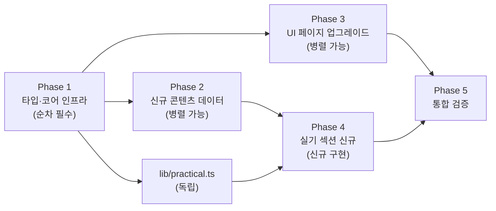

# 구현 계획서

| 항목 | 내용 |
|:---|:---|
| 사업명 | DAP Master — 데이터아키텍처 전문가 자격증 시험 준비 웹사이트 |
| 작성일 | 2026-06-03 |
| 버전 | v0.1 |
| 기반 문서 | 요구사항정의서 / 화면목록 / 클래스설계서 / 비즈니스규칙 / 유즈케이스 |
| 기술 스택 | Next.js 14 Pages Router + SSG (App Router 아님) |

---

## 핵심 발견 — 범위 최소화

탐색 결과 아래 파일은 이미 제네릭 구조로 **변경 불필요**:
- `lib/progress.ts` — CHAPTERS 루프 기반, 6과목 자동 지원
- `context/ProgressContext.tsx` — Record<number,...> 기반, 자동 확장
- `pages/theory/[chapterId].tsx` — getStaticPaths가 CHAPTERS 참조, 자동 확장
- `pages/quiz/chapter/[chapterId].tsx` — 동일
- `pages/quiz/wrong.tsx`, `pages/quiz/bookmarks.tsx` — 유지

---

## Phase 전체 개요



| Phase | 내용 | 전제조건 | 수정 파일 수 |
|:---:|:---|:---:|:---:|
| 1 | 타입·코어 인프라 | 없음 | 7개 |
| 2 | 신규 콘텐츠 데이터 | Phase 1 | 14개 신규 |
| 3 | 기존 UI 페이지 업그레이드 | Phase 1 | 5개 |
| 4 | 실기 연습 섹션 신규 구현 | Phase 2+lib | 8개 신규 |
| 5 | 통합 검증 및 테스트 갱신 | Phase 1~4 | 3개 |

---

## Phase 1 — 타입 & 코어 인프라

> **순서가 중요**: types/index.ts → lib/chapters.ts → lib/questions.ts → 나머지  
> 각 단계 완료 후 `npm run type-check`로 연쇄 오류 확인

### 1-1. `types/index.ts` 수정

```typescript
// 변경 1: Question.part
part: 1 | 2 | 3 | 4 | 5 | 6  // ← 5·6 추가

// 변경 2: ChapterMeta.part
part: 1 | 2 | 3 | 4 | 5 | 6  // ← 5·6 추가

// 변경 3: ExamResult 필드 추가
part5Score: number
part6Score: number

// 변경 4: ProgressStore.lastVisited.type
type: 'theory' | 'quiz' | 'practical'  // ← 'practical' 추가

// 신규 추가
export type PracticalType    = 'logical_model' | 'standard_form'
export type PracticalSubtype = 'type1' | 'type2' | 'entity' | 'standard'
export type DataNotation     = 'barker' | 'ie'

export interface PracticalProblem {
  id: string; type: PracticalType; subtype: PracticalSubtype
  title: string; notation: DataNotation; scenario: string
  requirements: string[]; sampleAnswer: string; checkPoints: string[]
}

export interface PracticalDraft {
  textAnswer: string; imageDataUrl: string | null; savedAt: number
}
```

### 1-2. `lib/chapters.ts` 수정

```typescript
// CHAPTERS 배열에 추가 (14→21개)
{ id: 'part5_ch1', part: 5, chapter: 1, title: '데이터베이스 설계',     idPrefix: 'p5c1_', questionCount: 0 },
{ id: 'part5_ch2', part: 5, chapter: 2, title: '데이터베이스 이용',     idPrefix: 'p5c2_', questionCount: 0 },
{ id: 'part5_ch3', part: 5, chapter: 3, title: '데이터베이스 성능 개선', idPrefix: 'p5c3_', questionCount: 0 },
{ id: 'part6_ch1', part: 6, chapter: 1, title: '데이터 이해',           idPrefix: 'p6c1_', questionCount: 0 },
{ id: 'part6_ch2', part: 6, chapter: 2, title: '데이터 구조 이해',      idPrefix: 'p6c2_', questionCount: 0 },
{ id: 'part6_ch3', part: 6, chapter: 3, title: '데이터 관리 프로세스 이해', idPrefix: 'p6c3_', questionCount: 0 },
{ id: 'part6_ch4', part: 6, chapter: 4, title: '데이터 품질 관리 관점', idPrefix: 'p6c4_', questionCount: 0 },

// PART_TITLES 추가
5: '데이터베이스 설계와 이용',
6: '데이터 품질 관리이해',
```

### 1-3. `lib/questions.ts` 수정

```typescript
// 신규 상수 추가
const PART_QUOTA: Record<number, number> = {
  1: 10, 2: 10, 3: 10, 4: 25, 5: 10, 6: 10  // 합계 75
}

// sampleExamQuestions 수정
export function sampleExamQuestions(): Question[] {
  const result: Question[] = []
  for (let part = 1; part <= 6; part++) {       // ← 4→6
    const quota = PART_QUOTA[part]              // ← 하드코딩 제거
    const partChapters = CHAPTERS.filter(c => c.part === part)
    const partQuestions = partChapters.flatMap(ch => loadChapterQuestions(ch.id))
    const shuffled = [...partQuestions].sort(() => Math.random() - 0.5)
    result.push(...shuffled.slice(0, quota))
  }
  return result  // 총 75문항
}
```

### 1-4. `lib/progress.ts` 수정

```typescript
// loadProgress() 최상단에 추가
function migrateIfNeeded() {
  if (typeof window === 'undefined') return
  const old = localStorage.getItem('dasp_progress')
  const cur = localStorage.getItem('dap_progress')
  if (old && !cur) localStorage.setItem('dap_progress', old)
}
// loadProgress() 호출 시 첫 줄에 migrateIfNeeded() 실행
```

### 1-5. `scripts/validate-questions.ts` 수정

```typescript
// 정규식 p[1-4] → p[1-6]
const QUESTION_ID_REGEX = /^p[1-6]c[1-4]_\d{3}$/
```

### 1-6. `lib/exam.ts` 신규 생성

```typescript
// pages/quiz/exam.tsx의 computeResult() 로직을 이 파일로 이전
export const PART_MAX_SCORE: Record<number, number> = {
  1: 8, 2: 8, 3: 8, 4: 20, 5: 8, 6: 8
}
export const PART_QUOTA: Record<number, number> = {
  1: 10, 2: 10, 3: 10, 4: 25, 5: 10, 6: 10
}
export const POINTS_PER_Q = 0.8

export function calcPartScore(correct: number): number
export function isPartPassed(part: number, score: number): boolean
export function isExamPassed(scores: Record<number, number>): boolean
export function computeExamResult(answers, questions, elapsed): ExamResult
```

### 1-7. `lib/practical.ts` 신규 생성

```typescript
export function getPracticalProblems(): PracticalProblem[]
export function getPracticalById(id: string): PracticalProblem | undefined
export function savePracticalDraft(practiceId: string, draft: PracticalDraft): void
export function loadPracticalDraft(practiceId: string): PracticalDraft | null
export function clearPracticalDraft(practiceId: string): void
```

**Phase 1 검증 게이트**
```bash
npm run type-check   # 오류 0건
npm run test         # 기존 13개 테스트 통과
```

---

## Phase 2 — 신규 콘텐츠 데이터

> Phase 1 완료 후 병렬 진행 가능

### 2-A. 이론 MD 파일 (7개 신규)

파일명 형식: `data/theory/part{N}_ch{M}.md`

| 파일 | 주요 내용 |
|:---|:---|
| `part5_ch1.md` | 저장공간·무결성·인덱스·분산·보안 설계 |
| `part5_ch2.md` | DBMS·데이터 액세스·트랜잭션·백업/복구 |
| `part5_ch3.md` | 성능 개선 방법론·조인·애플리케이션·서버 성능 |
| `part6_ch1.md` | 품질 관리 프레임워크·표준/모델/관리/업무 데이터 |
| `part6_ch2.md` | 개념/논리/물리 데이터 모델·DB·사용자 뷰 |
| `part6_ch3.md` | 관리 정책·표준/요구/모델/흐름/DB/활용 관리 |
| `part6_ch4.md` | 표준/모델/값/활용 관점 품질관리 프로세스 |

구조 규칙 (RULES.md 준수):
```markdown
# {N}과목 {M}장: {챕터 제목}
## 1. {주요항목1}   ← TheoryTOC가 추출하는 레벨
### {세부항목1}
```

### 2-B. 필기 문제 JSON (7개 신규)

파일명 형식: `data/questions/part{N}_ch{M}.json`

- ID: `p{N}c{M}_{DDD}` (001부터 순차)
- 챕터당 최소 15문항
- 난이도 비율: 하 20% / 중 55% / 상 25%

### 2-C. 모의고사 JSON 재구성 (2개 수정)

`data/questions/mockexam/exam{1,2}.json` → 75문항으로 재구성
- 1·2·3·5·6과목: 각 10문항
- 4과목: 25문항
- ID: `exam{N}_{DDD}`

### 2-D. 실기 문제 JSON (5개 이상 신규)

`data/practical/prac_{DDD}.json`

| prac_ID | type | subtype |
|:---|:---|:---|
| prac_001 | logical_model | type1 |
| prac_002 | logical_model | type2 |
| prac_003 | logical_model | type1 |
| prac_004 | standard_form | entity |
| prac_005 | standard_form | standard |

**Phase 2 검증 게이트**
```bash
npx ts-node scripts/validate-questions.ts  # 오류 0건
```

---

## Phase 3 — 기존 UI 페이지 업그레이드

> Phase 1 완료 후, Phase 2와 병렬 진행 가능

### 3-1. `pages/theory/index.tsx`

```typescript
// 변경 1: 4→6과목 루프
{[1, 2, 3, 4, 5, 6].map(part => {  // ← [1,2,3,4] → [1,2,3,4,5,6]

// 변경 2: PART_COLORS에 5·6과목 색상 추가
5: { bg: 'bg-teal-50', border: 'border-teal-200', badge: 'bg-teal-100 text-teal-700', bar: 'bg-teal-500', icon: '🗄️' },
6: { bg: 'bg-orange-50', border: 'border-orange-200', badge: 'bg-orange-100 text-orange-700', bar: 'bg-orange-500', icon: '✅' },

// 변경 3: 헤더 문구
"DAsP 시험 4과목" → "DAP 시험 6과목"
```

### 3-2. `pages/quiz/index.tsx`

- `[1,2,3,4]` → `[1,2,3,4,5,6]` 루프
- 21챕터 링크 자동 생성 (CHAPTERS 참조 시 자동)

### 3-3. `pages/quiz/exam.tsx`

```typescript
// 변경 1: 타이머 90분→240분
const EXAM_SECONDS = 14400  // ← 5400 → 14400

// 변경 2: PART_TITLES 6과목 (import from lib/exam.ts)
// 기존 로컬 상수 제거, lib/exam.ts의 PART_TITLES 사용

// 변경 3: computeResult → lib/exam.ts의 computeExamResult()로 교체
// 6과목 partScores 자동 계산

// 변경 4: 결과 화면 partScores 배열
const partScores = [1,2,3,4,5,6].map(p => toScore(p))  // ← 4개→6개

// 변경 5: 합격 판정 (isExamPassed 사용)
const passed = isExamPassed(scoresByPart)

// 변경 6: 인트로 화면 통계
"50문항" → "75문항"
"90분"  → "240분"
"4과목" → "6과목"
"1~3과목 10문항, 4과목 20문항" → "1·2·3·5·6과목 10문항, 4과목 25문항"

// 변경 7: 모의고사 desc 문구
desc: '고정 50문항 세트 1' → '고정 75문항 세트 1'
```

### 3-4. `pages/quiz/result.tsx`

```typescript
// 변경 1: 쿼리 파라미터에 p5·p6 추가
const { score, p1, p2, p3, p4, p5, p6, time, total, correct } = router.query
const partScores = [p1,p2,p3,p4,p5,p6].map(Number)

// 변경 2: PART_TITLES 6과목
const PART_TITLES: Record<number, string> = {
  1: '전사아키텍처 이해', 2: '데이터 요건 분석', 3: '데이터 표준화',
  4: '데이터 모델링', 5: '데이터베이스 설계와 이용', 6: '데이터 품질 관리이해',
}

// 변경 3: 실기 40점 안내 배너 추가
<div className="q-card bg-amber-50 border border-amber-300">
  <p className="font-semibold text-amber-800">실기 40점 별도 준비 필요</p>
  <p>논리 데이터 모델·표준화 정의서 작성 연습 → 실기 연습 메뉴 활용</p>
</div>
```

### 3-5. `pages/index.tsx` (대시보드)

```typescript
// 변경: 과목 루프 확장
[1,2,3,4,5,6].map(part => ...)
// "DAsP" → "DAP" 텍스트 교체
```

**Phase 3 검증 게이트**
```bash
npm run build   # SSG: theory×21, quiz/chapter×21 경로 확인
```

---

## Phase 4 — 실기 연습 섹션 신규 구현

> Phase 2(실기 JSON) + lib/practical.ts 완료 후

### 4-1. `pages/practical/index.tsx`

```typescript
// getStaticProps: getPracticalProblems() 로드
// 유형 설명 카드 (논리모델 / 표준화정의서)
// PracticalCard 목록 (type 뱃지, 제목, notation)
// 표기법 안내 섹션 (바커 vs IE, 혼용 감점 강조)
```

### 4-2. `pages/practical/[practiceId].tsx`

```typescript
// getStaticPaths: getPracticalProblems().map(p => p.id)
// getStaticProps: getPracticalById(practiceId)
// 레이아웃: 좌 40% (ScenarioPanel) / 우 60% (AnswerPanel)
// 탭: 텍스트 서술 | 이미지 업로드
// 답안 자동 저장: savePracticalDraft (debounce 500ms)
// 재방문 시 loadPracticalDraft 복원
```

### 4-3. `components/practical/`

| 컴포넌트 | 역할 |
|:---|:---|
| `PracticalLayout.tsx` | 좌우 분할 래퍼 (CSS grid) |
| `ScenarioPanel.tsx` | scenario 텍스트 + requirements 체크리스트 |
| `AnswerTextEditor.tsx` | textarea, onChange → savePracticalDraft |
| `ModelImageUpload.tsx` | file input → Canvas 리사이즈(1920px) → 2MB 압축 → preview |
| `ScoringGuide.tsx` | 채점 포인트 토글 + sampleAnswer 표시 |

**Phase 4 검증 게이트**
```bash
npm run build   # practical×N 경로 생성 확인
# 브라우저: /practical → 문제 목록 → 풀이 → 이미지 업로드 → 채점 포인트 확인
```

---

## Phase 5 — 통합 검증 및 테스트 갱신

### 검증 체크리스트

```bash
npm run type-check   # 오류 0건
npm run test         # 전체 통과
npm run lint         # 오류 0건
npm run build        # SSG 경로 확인:
                     #   theory: 21개 (part1~6)
                     #   quiz/chapter: 21개
                     #   practical: 5개 이상
```

### 테스트 갱신

`lib/chapters.test.ts`:
```typescript
expect(CHAPTERS.length).toBe(21)
expect(PART_TITLES[5]).toBe('데이터베이스 설계와 이용')
expect(PART_TITLES[6]).toBe('데이터 품질 관리이해')
```

`lib/questions.test.ts` (신규):
```typescript
expect(sampleExamQuestions().length).toBe(75)
const byPart = groupBy(sampleExamQuestions(), q => q.part)
expect(byPart[4].length).toBe(25)
expect(byPart[5].length).toBe(10)
```

`lib/progress.test.ts`:
```typescript
// migrateIfNeeded: dasp_progress → dap_progress 복사 확인
```

---

## SCR-ID → 구현 작업 매핑

| SCR-ID | 화면명 | Phase | 담당 파일 | 작업 유형 |
|:---|:---|:---:|:---|:---:|
| SCR-001 | 대시보드 홈 | 3 | `pages/index.tsx` | 수정 |
| SCR-002 | 이론 목차 | 3 | `pages/theory/index.tsx` | 수정 |
| SCR-003 | 이론 본문 | 자동 | `pages/theory/[chapterId].tsx` | 변경 없음 |
| SCR-004 | 문제 풀기 허브 | 3 | `pages/quiz/index.tsx` | 수정 |
| SCR-005 | 단원별 문제 풀이 | 자동 | `pages/quiz/chapter/[chapterId].tsx` | 변경 없음 |
| SCR-006 | 오답 노트 | 유지 | `pages/quiz/wrong.tsx` | 변경 없음 |
| SCR-007 | 북마크 | 유지 | `pages/quiz/bookmarks.tsx` | 변경 없음 |
| SCR-008 | 모의고사 인트로 | 3 | `pages/quiz/exam.tsx` | 수정 |
| SCR-009 | 모의고사 진행 | 3 | `pages/quiz/exam.tsx` | 수정 |
| SCR-010 | 모의고사 결과(인라인) | 3 | `pages/quiz/exam.tsx` | 수정 |
| SCR-011 | 시험 결과(독립) | 3 | `pages/quiz/result.tsx` | 수정 |
| SCR-012 | 실기 연습 허브 ★ | 4 | `pages/practical/index.tsx` | **신규** |
| SCR-013 | 실기 문제 풀이 ★ | 4 | `pages/practical/[practiceId].tsx` | **신규** |

---

## 전체 변경 파일 목록

### 수정 (13개)
```
types/index.ts
lib/chapters.ts
lib/questions.ts
lib/progress.ts
scripts/validate-questions.ts
pages/index.tsx
pages/theory/index.tsx
pages/quiz/index.tsx
pages/quiz/exam.tsx
pages/quiz/result.tsx
lib/chapters.test.ts
lib/progress.test.ts
docs/ai-dlc/README.md
```

### 신규 생성 (24개 이상)
```
lib/exam.ts
lib/practical.ts
pages/practical/index.tsx
pages/practical/[practiceId].tsx
components/practical/PracticalLayout.tsx
components/practical/ScenarioPanel.tsx
components/practical/AnswerTextEditor.tsx
components/practical/ModelImageUpload.tsx
components/practical/ScoringGuide.tsx
lib/questions.test.ts (신규)
data/theory/part5_ch{1-3}.md  (3개)
data/theory/part6_ch{1-4}.md  (4개)
data/questions/part5_ch{1-3}.json  (3개)
data/questions/part6_ch{1-4}.json  (4개)
data/questions/mockexam/exam1.json  (75문항 재구성)
data/questions/mockexam/exam2.json  (75문항 재구성)
data/practical/prac_001~005.json  (5개 이상)
```

---

## 문서 버전 이력

| 버전 | 일자 | 변경 내용 |
|:---|:---|:---|
| v0.1 | 2026-06-03 | 초안 생성 — 5 Phase 구현 계획, SCR-013 매핑 완료 |
