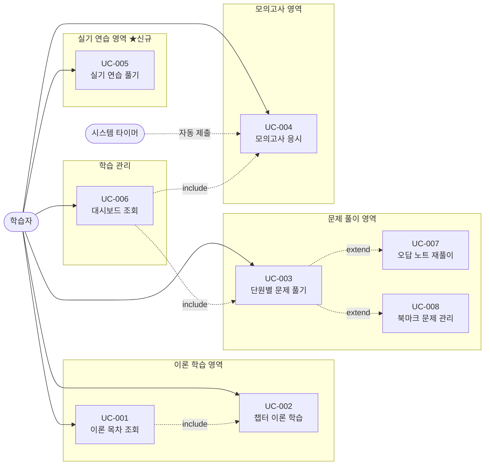

# 유즈케이스 문서

| 항목 | 내용 |
|:---|:---|
| 사업명 | DAP Master — 데이터아키텍처 전문가 자격증 시험 준비 웹사이트 |
| 작성일 | 2026-06-03 |
| 버전 | v0.1 |
| 근거 문서 | 요구사항정의서 / 화면목록 / 비즈니스규칙 |
| 총 UC 수 | 8개 (UC-001 ~ UC-008) |

---

## 1. 액터 목록

| 액터 ID | 액터명 | 설명 |
|:---|:---|:---|
| ACT-001 | 학습자 | DAP 시험 준비를 위해 이론 학습·문제 풀이·모의고사·실기 연습을 수행하는 단일 사용자. 인증 없음, 모든 화면 접근 가능. |
| ACT-002 | 시스템 (타이머) | 모의고사 240분 타임아웃을 감지하여 자동 제출을 트리거하는 시스템 액터. |

> 이 앱은 비인증 단일 역할 앱으로, 관리자·외부 시스템 액터가 없다.

---

## 2. 유즈케이스 목록

| UC-ID | 유즈케이스명 | 액터 | 관련 FR | 관련 SCR | 우선순위 |
|:---|:---|:---:|:---|:---|:---:|
| UC-001 | 이론 목차 조회 | 학습자 | FR-001 | SCR-002 | 상 |
| UC-002 | 챕터 이론 학습 | 학습자 | FR-002, FR-003, FR-004 | SCR-003 | 상 |
| UC-003 | 단원별 문제 풀기 | 학습자 | FR-005~009 | SCR-004, SCR-005 | 상 |
| UC-004 | 모의고사 응시 | 학습자, 시스템 | FR-010~015 | SCR-008, SCR-009, SCR-010, SCR-011 | 상 |
| UC-005 | 실기 연습 풀기 | 학습자 | FR-016~021 | SCR-012, SCR-013 | 상 |
| UC-006 | 학습 현황 대시보드 조회 | 학습자 | FR-022 | SCR-001 | 상 |
| UC-007 | 오답 노트 재풀이 | 학습자 | FR-023 | SCR-006 | 상 |
| UC-008 | 북마크 문제 관리 | 학습자 | FR-024 | SCR-007 | 중 |

---

## 3. 유즈케이스 다이어그램

---

## 4. 유즈케이스 상세

---

### UC-001: 이론 목차 조회

| 항목 | 내용 |
|:---|:---|
| UC-ID | UC-001 |
| UC명 | 이론 목차 조회 |
| 액터 | 학습자 |
| 관련 FR | FR-001 |
| 관련 BR | — |
| 사전 조건 | 학습자가 브라우저에서 `/theory`에 접근한다. |
| 사후 조건 | 학습자가 6과목 21챕터 목록을 확인하고 원하는 챕터를 선택할 수 있다. |

#### 기본 흐름

| 단계 | 액터 | 행동 |
|:---:|:---:|:---|
| 1 | 학습자 | GNB의 "이론 학습" 메뉴를 클릭하거나 `/theory`로 직접 접근한다. |
| 2 | 시스템 | 6과목 섹션 헤더(과목명·색상)와 챕터 카드 그리드를 렌더링한다. |
| 3 | 시스템 | localStorage(`dap_progress`)에서 챕터별 문제 정답률을 읽어 각 카드에 프로그레스 바로 표시한다. |
| 4 | 학습자 | 원하는 챕터 카드를 클릭한다. |
| 5 | 시스템 | 해당 챕터 이론 본문 페이지(`/theory/[chapterId]`)로 이동한다. → UC-002 |

#### 대안 흐름

| 분기 | 조건 | 행동 |
|:---|:---|:---|
| A1 | 첫 방문(학습 이력 없음) | 정답률 표시 대신 "이론 보기 →" 텍스트를 카드에 표시한다. |

#### 예외 흐름

| 분기 | 조건 | 행동 |
|:---|:---|:---|
| E1 | localStorage 읽기 오류(SSR 환경) | `typeof window === 'undefined'` 가드 적용, 진도율 없이 카드만 렌더링한다. |

---

### UC-002: 챕터 이론 학습

| 항목 | 내용 |
|:---|:---|
| UC-ID | UC-002 |
| UC명 | 챕터 이론 학습 |
| 액터 | 학습자 |
| 관련 FR | FR-002, FR-003, FR-004 |
| 관련 BR | BR-029 (이론 MD 헤딩 구조), BR-034 (XSS 방어) |
| 사전 조건 | UC-001에서 챕터를 선택하거나 `/theory/[chapterId]` URL을 직접 입력한다. |
| 사후 조건 | 학습자가 챕터 이론을 읽고 연관 문제를 확인할 수 있다. |

#### 기본 흐름

| 단계 | 액터 | 행동 |
|:---:|:---:|:---|
| 1 | 학습자 | `/theory/[chapterId]`에 접근한다. |
| 2 | 시스템 | `data/theory/part{N}_ch{M}.md` 파일을 읽어 HTML로 렌더링한다. |
| 3 | 시스템 | 마크다운의 `##` 헤딩을 추출해 좌측 TOC 사이드바를 생성한다. |
| 4 | 학습자 | TOC 항목을 클릭해 원하는 섹션으로 스크롤 이동한다. |
| 5 | 시스템 | 페이지 하단에 해당 챕터의 연관 문제 링크를 표시한다. |
| 6 | 학습자 | 연관 문제 링크를 클릭한다. → UC-003 |

#### 대안 흐름

| 분기 | 조건 | 행동 |
|:---|:---|:---|
| A1 | 연관 문제가 없는 챕터 | "연관 문제 없음" 텍스트 또는 섹션 미표시. |
| A2 | 모바일 환경 | TOC 사이드바가 접히거나 상단으로 이동하는 반응형 레이아웃 적용. |

#### 예외 흐름

| 분기 | 조건 | 행동 |
|:---|:---|:---|
| E1 | 존재하지 않는 chapterId | `fallback: false` 적용으로 404 페이지 반환. (BR-028) |
| E2 | MD 파일에 `<script>` 태그 포함 | rehype-raw의 sanitize 처리로 실행 차단. (BR-034) |

---

### UC-003: 단원별 문제 풀기

| 항목 | 내용 |
|:---|:---|
| UC-ID | UC-003 |
| UC명 | 단원별 문제 풀기 |
| 액터 | 학습자 |
| 관련 FR | FR-005, FR-006, FR-007, FR-008, FR-009 |
| 관련 BR | BR-016 (챕터-문제 연결), BR-021 (북마크 토글), BR-035 (오답 필터) |
| 사전 조건 | 학습자가 문제 풀기 허브(`/quiz`)에서 챕터를 선택한다. |
| 사후 조건 | 학습자가 챕터 문제를 풀고 정답·해설을 확인하며, 오답은 진도에 기록된다. |

#### 기본 흐름

| 단계 | 액터 | 행동 |
|:---:|:---:|:---|
| 1 | 학습자 | 문제 풀기 허브(`/quiz`)에서 과목·챕터를 선택한다. |
| 2 | 시스템 | `data/questions/part{N}_ch{M}.json`을 로드하여 첫 번째 문제를 QuestionCard로 표시한다. |
| 3 | 학습자 | 4개의 선택지 중 하나를 클릭한다. |
| 4 | 시스템 | 정답·오답 여부를 즉시 피드백하고 해설을 AnswerFeedback에 표시한다. `dap_progress.answers`에 결과를 저장한다. |
| 5 | 학습자 | "다음 문제" 버튼 또는 QuizNavigator로 이동한다. |
| 6 | 단계 3~5 반복 | 챕터의 모든 문제를 순환한다. |

#### 대안 흐름

| 분기 | 조건 | 행동 |
|:---|:---|:---|
| A1 | 이미 풀었던 문제로 재이동 | 선택했던 답이 선택된 상태로 표시되고 피드백도 함께 표시된다. |
| A2 | 북마크 버튼 클릭 | 해당 문제 ID를 `dap_progress.bookmarks`에 추가 또는 제거한다. (BR-021) |
| A3 | QuizNavigator로 특정 번호 직접 이동 | 해당 인덱스로 이동하며, 답변 이력이 있으면 피드백을 표시한다. |

#### 예외 흐름

| 분기 | 조건 | 행동 |
|:---|:---|:---|
| E1 | 해당 챕터의 문제 JSON이 없음 | "준비 중인 문제입니다" 메시지 표시 후 문제 풀기 허브로 이동 유도. |
| E2 | localStorage 저장 실패 | 진도는 저장 안 되지만 풀이 자체는 계속 진행 가능. |

---

### UC-004: 모의고사 응시

| 항목 | 내용 |
|:---|:---|
| UC-ID | UC-004 |
| UC명 | 모의고사 응시 |
| 액터 | 학습자, 시스템(타이머) |
| 관련 FR | FR-010, FR-011, FR-012, FR-013, FR-014, FR-015 |
| 관련 BR | BR-001~010, BR-011~014 (점수·합격·세션 관련) |
| 사전 조건 | 학습자가 `/quiz/exam`(모의고사 인트로)에 진입한다. |
| 사후 조건 | 6과목별 점수와 합격 여부가 표시되고, 결과가 `examHistory`에 저장된다. |

#### 기본 흐름

| 단계 | 액터 | 행동 |
|:---:|:---:|:---|
| 1 | 학습자 | 모의고사 인트로(SCR-008)에서 응시 모드(랜덤/exam1/exam2)를 선택한다. |
| 2 | 학습자 | "시험 시작" 버튼을 클릭한다. |
| 3 | 시스템 | 선택 모드에 따라 75문항 세트를 구성한다. (BR-008 또는 BR-009) |
| 4 | 시스템 | ExamSession을 생성하고 `examEndTime = now + 14400000ms`로 설정한다. `dap_exam_session`에 저장. (BR-011) |
| 5 | 학습자 | 시험 진행 화면(SCR-009)에서 문항에 답변한다. |
| 6 | 시스템 | 답변할 때마다 `dap_exam_session`을 자동 저장한다. (BR-011) |
| 7 | 학습자 | 모든 문항 답변 후 "제출하기"를 클릭한다. |
| 8 | 시스템 | 6과목별 정답 수 × 0.8점을 계산한다. (BR-001~003) |
| 9 | 시스템 | 전체 합격선(36점)·과목별 합격선 판정 후 결과 화면(SCR-010)을 표시한다. (BR-004~007) |
| 10 | 시스템 | 결과를 `dap_progress.examHistory`에 저장하고 실기 40점 안내 배너를 표시한다. (BR-007) |

#### 대안 흐름

| 분기 | 조건 | 행동 |
|:---|:---|:---|
| A1 | 저장된 세션 존재 | 인트로 화면에 "이어서 풀기" 배너가 표시된다. 클릭 시 남은 시간·답변 상태로 복원한다. (BR-012) |
| A2 | 시간 초과 (타이머 0) | 시스템이 현재 답변 상태로 자동 제출하고 채점을 실행한다. (BR-010) |

#### 예외 흐름

| 분기 | 조건 | 행동 |
|:---|:---|:---|
| E1 | 세션 복원 시 만료 확인 | examEndTime ≤ 현재 시각이면 세션을 삭제하고 "세션이 만료되었습니다" 안내 후 새 시험 유도. (BR-013) |
| E2 | 랜덤 모의고사 - 특정 과목 문제 부족 | 해당 과목 문제 풀에서 가능한 만큼만 추출. 단, 75문항 미달 시 경고 표시. |

---

### UC-005: 실기 연습 풀기

| 항목 | 내용 |
|:---|:---|
| UC-ID | UC-005 |
| UC명 | 실기 연습 풀기 |
| 액터 | 학습자 |
| 관련 FR | FR-016, FR-017, FR-018, FR-019, FR-020, FR-021 |
| 관련 BR | BR-022~026, BR-030 |
| 사전 조건 | 학습자가 실기 연습 허브(`/practical`)에 진입한다. |
| 사후 조건 | 학습자가 텍스트/이미지 답안을 작성하고 채점 포인트를 자가 확인한다. |

#### 기본 흐름

| 단계 | 액터 | 행동 |
|:---:|:---:|:---|
| 1 | 학습자 | 실기 연습 허브(SCR-012)에서 문제 목록을 확인하고 유형(논리모델/표준화정의서)을 선택한다. |
| 2 | 학습자 | 실기 문제 카드를 클릭하여 풀이 화면(SCR-013)으로 진입한다. |
| 3 | 시스템 | 좌측 패널에 지문(scenario)과 요구사항 목록을 렌더링한다. |
| 4 | 학습자 | 지문을 읽고 우측 "텍스트 서술" 탭에 엔터티·관계·속성 등을 텍스트로 작성한다. |
| 5 | 시스템 | 텍스트 변경 시 `dap_practical_{practiceId}`에 자동 저장한다. (BR-022) |
| 6 | 학습자 | "모델 이미지" 탭으로 전환하여 손으로 그린 모델 이미지를 업로드한다. |
| 7 | 시스템 | 이미지를 Canvas API로 리사이즈(최대 1920px) 후 base64로 저장한다. (BR-023~024) |
| 8 | 학습자 | "채점 포인트 확인" 버튼을 클릭한다. |
| 9 | 시스템 | ScoringGuide를 펼쳐 checkPoints 체크리스트와 sampleAnswer를 표시한다. |
| 10 | 학습자 | 체크리스트를 보며 자가 채점한다. |

#### 대안 흐름

| 분기 | 조건 | 행동 |
|:---|:---|:---|
| A1 | 텍스트만 작성(이미지 없음) | 이미지 탭은 비어있어도 텍스트 답안만으로 자가 채점 가능. |
| A2 | 이미지만 업로드 | 텍스트 없이 이미지만 업로드하여 채점 포인트와 비교. |
| A3 | 재방문 시 | `dap_practical_{practiceId}`에 저장된 이전 답안(텍스트+이미지)이 자동 복원. |
| A4 | 표기법 안내 확인 | 실기 허브(SCR-012)의 표기법 안내 섹션에서 바커/IE 차이를 사전 확인. (BR-030) |

#### 예외 흐름

| 분기 | 조건 | 행동 |
|:---|:---|:---|
| E1 | 이미지 업로드 후 2MB 초과 | Canvas 품질을 낮춰 재압축 반복. 그래도 초과 시 "파일이 너무 큽니다" 안내. (BR-024) |
| E2 | 존재하지 않는 practiceId | `fallback: false`로 404 반환. (BR-028) |

---

### UC-006: 학습 현황 대시보드 조회

| 항목 | 내용 |
|:---|:---|
| UC-ID | UC-006 |
| UC명 | 학습 현황 대시보드 조회 |
| 액터 | 학습자 |
| 관련 FR | FR-022 |
| 관련 BR | BR-019 (마이그레이션), BR-020 (서버가드) |
| 사전 조건 | 학습자가 홈(`/`)에 접근한다. |
| 사후 조건 | 학습자가 전체 학습 진도를 파악하고 다음 학습 행동을 결정한다. |

#### 기본 흐름

| 단계 | 액터 | 행동 |
|:---:|:---:|:---|
| 1 | 학습자 | 홈(`/`)에 접근한다. |
| 2 | 시스템 | `loadProgress()`로 `dap_progress`를 로드한다. (필요 시 `dasp_progress` 마이그레이션 실행) (BR-019) |
| 3 | 시스템 | HeroBanner(환영 메시지·마스코트), WeeklyXP(주간 XP·스트릭), ChapterProgress(6과목별 진도율)를 렌더링한다. |
| 4 | 시스템 | WeakChapters에서 정답률이 낮은 챕터 목록을 표시한다. |
| 5 | 학습자 | 취약 챕터 링크를 클릭하여 해당 챕터 문제 풀기로 이동한다. → UC-003 |

#### 대안 흐름

| 분기 | 조건 | 행동 |
|:---|:---|:---|
| A1 | 신규 사용자(학습 이력 없음) | 진도율 0%, 취약 챕터 없음 상태에서 "학습 경로(LearningPath)"를 강조 표시. |
| A2 | 모의고사 이력 있음 | ProgressChart에 과목별 최근 점수 추이를 표시한다. |

#### 예외 흐름

| 분기 | 조건 | 행동 |
|:---|:---|:---|
| E1 | 하이드레이션 전(SSR) | `isHydrated` false 상태에서는 진도 데이터를 숨기고 기본 레이아웃만 표시. |

---

### UC-007: 오답 노트 재풀이

| 항목 | 내용 |
|:---|:---|
| UC-ID | UC-007 |
| UC명 | 오답 노트 재풀이 |
| 액터 | 학습자 |
| 관련 FR | FR-023 |
| 관련 BR | BR-035 (오답 필터링) |
| 사전 조건 | 학습자가 최소 1개 이상의 오답을 기록한 상태에서 `/quiz/wrong`에 접근한다. |
| 사후 조건 | 학습자가 오답 문제를 재풀이하고 추가 학습 방향을 파악한다. |

#### 기본 흐름

| 단계 | 액터 | 행동 |
|:---:|:---:|:---|
| 1 | 학습자 | GNB 또는 링크를 통해 오답 노트(`/quiz/wrong`)에 접근한다. |
| 2 | 시스템 | `dap_progress.answers`에서 `result === 'wrong'`인 문제 ID를 필터링한다. (BR-035) |
| 3 | 시스템 | 필터된 ID로 해당 문제 목록을 과목·챕터별로 그룹화하여 표시한다. |
| 4 | 학습자 | 오답 문제를 클릭하여 재풀이한다. |
| 5 | 시스템 | 재풀이 결과를 `dap_progress.answers`에 업데이트한다. 정답 시 'correct'로 변경. |

#### 대안 흐름

| 분기 | 조건 | 행동 |
|:---|:---|:---|
| A1 | 재풀이 후 정답 | 해당 문제가 오답 목록에서 제거된다(상태가 'correct'로 갱신). |

#### 예외 흐름

| 분기 | 조건 | 행동 |
|:---|:---|:---|
| E1 | 오답 없음 | "오답이 없습니다. 문제를 풀어보세요!" 안내 메시지와 문제 풀기 링크 표시. |

---

### UC-008: 북마크 문제 관리

| 항목 | 내용 |
|:---|:---|
| UC-ID | UC-008 |
| UC명 | 북마크 문제 관리 |
| 액터 | 학습자 |
| 관련 FR | FR-024 |
| 관련 BR | BR-021 (북마크 토글), BR-036 (북마크 목록 조회) |
| 사전 조건 | 학습자가 문제 풀기 중 북마크를 추가했거나, `/quiz/bookmarks`에 직접 접근한다. |
| 사후 조건 | 학습자가 북마크 문제를 확인하고 선택적으로 재풀이한다. |

#### 기본 흐름

| 단계 | 액터 | 행동 |
|:---:|:---:|:---|
| 1 | 학습자 | 문제 풀기 중 문제 카드의 북마크 아이콘을 클릭한다. |
| 2 | 시스템 | 해당 문제 ID를 `dap_progress.bookmarks` 배열에 추가한다. (BR-021) |
| 3 | 학습자 | `/quiz/bookmarks`로 이동한다. |
| 4 | 시스템 | `bookmarks` 배열 ID로 `getAllQuestions()`에서 문제를 조회하여 목록으로 표시한다. (BR-036) |
| 5 | 학습자 | 북마크 문제를 클릭하여 재풀이한다. |

#### 대안 흐름

| 분기 | 조건 | 행동 |
|:---|:---|:---|
| A1 | 이미 북마크된 문제 재클릭 | `bookmarks` 배열에서 해당 ID를 제거한다. (BR-021) |

#### 예외 흐름

| 분기 | 조건 | 행동 |
|:---|:---|:---|
| E1 | 북마크 없음 | "북마크한 문제가 없습니다" 안내와 문제 풀기 링크 표시. |
| E2 | bookmarks에 있으나 문제 JSON이 없는 ID | 해당 항목을 건너뛰고 나머지 북마크 문제만 표시한다. (BR-036) |

---

## 5. FR-UC 커버리지 매핑

| FR-ID | FR 요구사항명 | 연계 UC | 커버 여부 |
|:---|:---|:---|:---:|
| FR-001 | 이론 목차 | UC-001 | ✓ |
| FR-002 | 이론 본문 렌더링 | UC-002 | ✓ |
| FR-003 | 이론 TOC 사이드바 | UC-002 | ✓ |
| FR-004 | 연관 문제 링크 | UC-002 | ✓ |
| FR-005 | 문제 풀기 허브 | UC-003 | ✓ |
| FR-006 | 단원별 문제 풀이 | UC-003 | ✓ |
| FR-007 | 정답·해설 피드백 | UC-003 | ✓ |
| FR-008 | 문제 네비게이터 | UC-003 (대안 A3) | ✓ |
| FR-009 | 난이도·태그 표시 | UC-003 | ✓ |
| FR-010 | 필기 모의고사 실행 | UC-004 | ✓ |
| FR-011 | 모의고사 결과 표시 | UC-004 (단계 8~9) | ✓ |
| FR-012 | 실기 40점 안내 | UC-004 (단계 10) | ✓ |
| FR-013 | 시험 세션 저장·복원 | UC-004 (대안 A1, 예외 E1) | ✓ |
| FR-014 | 랜덤 모의고사 | UC-004 (단계 3) | ✓ |
| FR-015 | 고정 모의고사 | UC-004 (대안 A1 선택지) | ✓ |
| FR-016 | 실기 연습 허브 | UC-005 (단계 1) | ✓ |
| FR-017 | 논리 데이터 모델 연습 (유형1) | UC-005 (단계 4~7) | ✓ |
| FR-018 | 논리 데이터 모델 연습 (유형2) | UC-005 (단계 4~7) | ✓ |
| FR-019 | 표준화 정의서 연습 | UC-005 (단계 4~5) | ✓ |
| FR-020 | 실기 채점 포인트 확인 | UC-005 (단계 8~10) | ✓ |
| FR-021 | 표기법 안내 | UC-005 (대안 A4) | ✓ |
| FR-022 | 대시보드 | UC-006 | ✓ |
| FR-023 | 오답 노트 | UC-007 | ✓ |
| FR-024 | 북마크 | UC-008 | ✓ |

**FR 커버리지: 24/24 (100%)**

---

## 6. 문서 버전 이력

| 버전 | 일자 | 변경 내용 |
|:---|:---|:---|
| v0.1 | 2026-06-03 | 초안 생성 — FR 24건 기반 8개 UC 도출, 기본·대안·예외 흐름 작성 |
