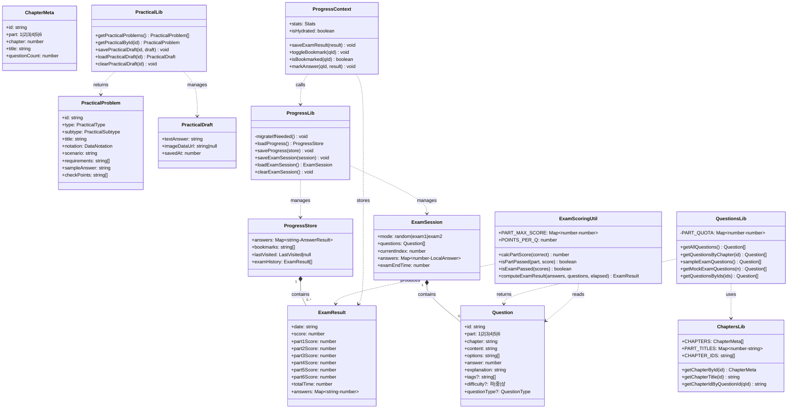
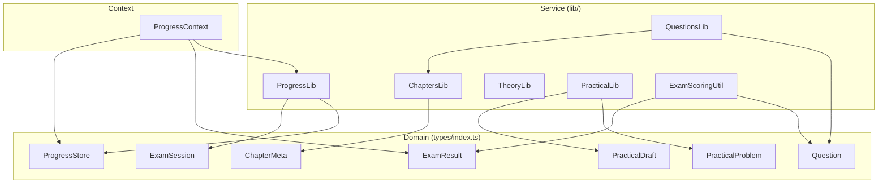

# 클래스 설계서

| 항목 | 내용 |
|:---|:---|
| 사업명 | DAP Master — 데이터아키텍처 전문가 자격증 시험 준비 웹사이트 |
| 작성일 | 2026-06-03 |
| 버전 | v0.1 |
| 기술 스택 | Next.js 14 / TypeScript 5 / React 18 (SSG, 서버 없음) |
| 아키텍처 | Domain → Service(lib) → Context → Pages/Components |

> **주의**: 이 앱은 서버가 없는 순수 클라이언트 SPA(SSG)이므로 전통적인 Controller/Repository 계층 없음.  
> 대신 **Domain(types) → Service(lib) → Context → UI(pages/components)** 4계층으로 매핑한다.

---

## 1. 클래스 목록

| CLS-ID | 클래스명 | 계층 | 파일 위치 | 상태 | 비고 |
|:---|:---|:---:|:---|:---:|:---|
| CLS-001 | Question | Domain | `types/index.ts` | 수정 | `part` 1\|2\|3\|4 → 1\|2\|3\|4\|5\|6 |
| CLS-002 | ExamResult | Domain | `types/index.ts` | 수정 | `part5Score`, `part6Score` 추가 |
| CLS-003 | ProgressStore | Domain | `types/index.ts` | 수정 | `lastVisited.type`에 `'practical'` 추가 |
| CLS-004 | ExamSession | Domain | `types/index.ts` | 유지 | 변경 없음 |
| CLS-005 | ChapterMeta | Domain | `types/index.ts` | 수정 | `part` 1\|2\|3\|4 → 1\|2\|3\|4\|5\|6 |
| CLS-006 | Stats | Domain | `types/index.ts` | 유지 | 변경 없음 |
| CLS-007 | PracticalProblem | Domain | `types/index.ts` | **신규** | 실기 문제 JSON 스키마 |
| CLS-008 | PracticalDraft | Domain | `types/index.ts` | **신규** | 실기 답안 localStorage 저장 구조 |
| CLS-009 | ChaptersLib | Service | `lib/chapters.ts` | 수정 | CHAPTERS 21개, PART_TITLES 6개 |
| CLS-010 | QuestionsLib | Service | `lib/questions.ts` | 수정 | PART_QUOTA 추가, 75문항 배분 |
| CLS-011 | ProgressLib | Service | `lib/progress.ts` | 수정 | 마이그레이션 로직 추가 |
| CLS-012 | TheoryLib | Service | `lib/theory.ts` | 유지 | 변경 없음 |
| CLS-013 | PracticalLib | Service | `lib/practical.ts` | **신규** | 실기 문제 로드·답안 저장 |
| CLS-014 | ExamScoringUtil | Service | `lib/exam.ts` | **신규** | BR-001~006 점수·합격 판정 |
| CLS-015 | ProgressContext | Context | `context/ProgressContext.tsx` | 수정 | byPart 6과목 통계 지원 |

---

## 2. 도메인 클래스 상세

### CLS-001: Question

| 항목 | 내용 |
|:---|:---|
| 계층 | Domain |
| 파일 | `types/index.ts` |
| 변경 | `part` 타입 확장 — `1 \| 2 \| 3 \| 4` → `1 \| 2 \| 3 \| 4 \| 5 \| 6` |

```typescript
export interface Question {
  id: string            // "p5c2_001" 형식 (p{과목}c{챕터}_{3자리})
  part: 1 | 2 | 3 | 4 | 5 | 6  // ← 5·6 추가
  chapter: string       // "part5_ch2" 등
  content: string
  options: string[]     // 4지선다, 고정 4개
  answer: number        // 0-based index
  explanation: string
  tags?: string[]
  difficulty?: '하' | '중' | '상'
  questionType?: QuestionType
}
```

---

### CLS-002: ExamResult

| 항목 | 내용 |
|:---|:---|
| 계층 | Domain |
| 파일 | `types/index.ts` |
| 변경 | `part5Score`, `part6Score` 필드 추가 (DR-005, BR-002) |

```typescript
export interface ExamResult {
  date: string
  score: number          // 필기 총점 (0~60)
  part1Score: number     // 과목별 점수 (0~8)
  part2Score: number
  part3Score: number
  part4Score: number     // 4과목: 0~20
  part5Score: number     // ← 신규 (0~8)
  part6Score: number     // ← 신규 (0~8)
  totalTime: number      // 소요 시간 (초)
  answers: Record<string, number>  // questionId → selectedIndex
}
```

---

### CLS-003: ProgressStore

| 항목 | 내용 |
|:---|:---|
| 계층 | Domain |
| 파일 | `types/index.ts` |
| 변경 | `lastVisited.type`에 `'practical'` 추가 (UC-005) |

```typescript
export interface ProgressStore {
  answers: Record<string, AnswerResult>
  bookmarks: string[]
  lastVisited: {
    type: 'theory' | 'quiz' | 'practical'  // ← 'practical' 추가
    id: string
  } | null
  examHistory: ExamResult[]
}
```

---

### CLS-004: ExamSession *(변경 없음)*

```typescript
export interface ExamSession {
  mode: 'random' | 'exam1' | 'exam2'
  questions: Question[]
  currentIndex: number
  answers: Record<number, { selectedIndex: number; result: AnswerResult }>
  examEndTime: number  // Unix ms (14400초 기준)
}
```

---

### CLS-005: ChapterMeta

| 항목 | 내용 |
|:---|:---|
| 변경 | `part` 타입 확장 — `1 \| 2 \| 3 \| 4` → `1 \| 2 \| 3 \| 4 \| 5 \| 6` |

```typescript
export interface ChapterMeta {
  id: string            // "part5_ch2"
  part: 1 | 2 | 3 | 4 | 5 | 6  // ← 5·6 추가
  chapter: number       // 챕터 번호 (1~4)
  title: string
  questionCount: number
}
```

---

### CLS-006: Stats *(변경 없음)*

```typescript
export interface Stats {
  total: number
  attempted: number
  correct: number
  byChapter: Record<string, { total: number; correct: number; attempted: number }>
  byPart: Record<number, { total: number; correct: number; attempted: number }>
}
```

---

### CLS-007: PracticalProblem ★신규

| 항목 | 내용 |
|:---|:---|
| 계층 | Domain |
| 파일 | `types/index.ts` |
| 근거 | DR-003, CLAUDE.md 실기 JSON 스키마, BR-025~026 |

```typescript
export type PracticalType    = 'logical_model' | 'standard_form'
export type PracticalSubtype = 'type1' | 'type2' | 'entity' | 'standard'
export type DataNotation     = 'barker' | 'ie'

export interface PracticalProblem {
  id: string              // "prac_001" (prac_\d{3} 형식)
  type: PracticalType
  subtype: PracticalSubtype
  title: string
  notation: DataNotation
  scenario: string        // 지문 (A4 2~3장 분량)
  requirements: string[]  // 요구사항 체크리스트
  sampleAnswer: string    // 모범답안 요약
  checkPoints: string[]   // 채점 포인트 목록
}
```

---

### CLS-008: PracticalDraft ★신규

| 항목 | 내용 |
|:---|:---|
| 계층 | Domain |
| 파일 | `types/index.ts` |
| 근거 | BR-022, BR-025 (localStorage `dap_practical_{practiceId}` 저장 구조) |

```typescript
export interface PracticalDraft {
  textAnswer: string        // 텍스트 서술 답안
  imageDataUrl: string | null  // base64 이미지 (리사이즈 후)
  savedAt: number           // 저장 시각 Unix ms
}
```

---

## 3. 서비스 클래스 상세 (lib/)

### CLS-009: ChaptersLib

| 항목 | 내용 |
|:---|:---|
| 파일 | `lib/chapters.ts` |
| 변경 | CHAPTERS 21개(5·6과목 7개 추가), PART_TITLES 6개 |

```typescript
// lib/chapters.ts

export const CHAPTERS: ChapterMeta[] = [
  // 1과목 3개, 2과목 4개, 3과목 3개, 4과목 4개 (기존)
  // 5과목 3개 ← 신규
  { id: 'part5_ch1', part: 5, chapter: 1, title: '데이터베이스 설계',    idPrefix: 'p5c1_', questionCount: 0 },
  { id: 'part5_ch2', part: 5, chapter: 2, title: '데이터베이스 이용',    idPrefix: 'p5c2_', questionCount: 0 },
  { id: 'part5_ch3', part: 5, chapter: 3, title: '데이터베이스 성능 개선', idPrefix: 'p5c3_', questionCount: 0 },
  // 6과목 4개 ← 신규
  { id: 'part6_ch1', part: 6, chapter: 1, title: '데이터 이해',           idPrefix: 'p6c1_', questionCount: 0 },
  { id: 'part6_ch2', part: 6, chapter: 2, title: '데이터 구조 이해',      idPrefix: 'p6c2_', questionCount: 0 },
  { id: 'part6_ch3', part: 6, chapter: 3, title: '데이터 관리 프로세스 이해', idPrefix: 'p6c3_', questionCount: 0 },
  { id: 'part6_ch4', part: 6, chapter: 4, title: '데이터 품질 관리 관점', idPrefix: 'p6c4_', questionCount: 0 },
]  // 합계: 21개

export const PART_TITLES: Record<number, string> = {
  1: '전사아키텍처 이해',
  2: '데이터 요건 분석',
  3: '데이터 표준화',
  4: '데이터 모델링',
  5: '데이터베이스 설계와 이용',  // ← 신규
  6: '데이터 품질 관리이해',       // ← 신규
}

// 기존 함수 유지 (변경 없음)
export function getChapterById(id: string): ChapterMeta | undefined
export function getChapterTitle(id: string): string
export function getChapterIdByQuestionId(questionId: string): string | undefined
```

---

### CLS-010: QuestionsLib

| 항목 | 내용 |
|:---|:---|
| 파일 | `lib/questions.ts` |
| 변경 | `PART_QUOTA` 상수 추가, `sampleExamQuestions` 75문항 6과목 배분 (BR-008, CR-005) |

```typescript
// lib/questions.ts

const PART_QUOTA: Record<number, number> = {
  1: 10, 2: 10, 3: 10, 4: 25, 5: 10, 6: 10  // 합계 75
}  // ← 신규 상수

export function getAllQuestions(): Question[]
export function getQuestionsByChapter(chapterId: string): Question[]
export function sampleExamQuestions(): Question[]  // ← 6과목 75문항으로 수정
export function getMockExamQuestions(examNum: 1 | 2): Question[]
export function getQuestionsByIds(ids: string[]): Question[]
```

**`sampleExamQuestions` 수정 로직:**
```typescript
export function sampleExamQuestions(): Question[] {
  const result: Question[] = []
  for (let part = 1; part <= 6; part++) {        // ← 6과목으로 확장
    const quota = PART_QUOTA[part]               // ← PART_QUOTA 참조
    const partChapters = CHAPTERS.filter(c => c.part === part)
    const partQuestions = partChapters.flatMap(ch => loadChapterQuestions(ch.id))
    const shuffled = [...partQuestions].sort(() => Math.random() - 0.5)
    result.push(...shuffled.slice(0, quota))
  }
  return result  // 총 75문항
}
```

---

### CLS-011: ProgressLib

| 항목 | 내용 |
|:---|:---|
| 파일 | `lib/progress.ts` |
| 변경 | `migrateIfNeeded()` 추가, localStorage 키 `dap_progress` (BR-019, BR-020) |

```typescript
// lib/progress.ts

// ← 신규: 마이그레이션 함수
function migrateIfNeeded(): void {
  if (typeof window === 'undefined') return          // BR-020
  const old = localStorage.getItem('dasp_progress')
  const cur = localStorage.getItem('dap_progress')
  if (old && !cur) {
    localStorage.setItem('dap_progress', old)
    // dasp_progress 삭제 안 함 (BR-019: 롤백 보험)
  }
}

export function loadProgress(): ProgressStore      // loadProgress() 진입 시 migrateIfNeeded() 호출
export function saveProgress(store: ProgressStore): void

export function saveExamSession(session: ExamSession): void
export function loadExamSession(): ExamSession | null
export function clearExamSession(): void
```

---

### CLS-012: TheoryLib *(변경 없음)*

```typescript
// lib/theory.ts
export function getChapterContent(chapterId: string): string
// data/theory/part{N}_ch{M}.md를 읽어 마크다운 문자열 반환
```

---

### CLS-013: PracticalLib ★신규

| 항목 | 내용 |
|:---|:---|
| 파일 | `lib/practical.ts` (신규 생성) |
| 근거 | FR-016~020, DR-003, BR-022, BR-025~026 |

```typescript
// lib/practical.ts

function loadPracticalFile(id: string): PracticalProblem {
  return require(`@/data/practical/${id}.json`) as PracticalProblem
}

export function getPracticalProblems(): PracticalProblem[]
// data/practical/ 디렉터리의 모든 prac_NNN.json 로드

export function getPracticalById(id: string): PracticalProblem | undefined
// prac_\d{3} 형식 id로 특정 문제 반환

export function savePracticalDraft(practiceId: string, draft: PracticalDraft): void {
  if (typeof window === 'undefined') return         // BR-020
  localStorage.setItem(`dap_practical_${practiceId}`, JSON.stringify(draft))  // BR-025
}

export function loadPracticalDraft(practiceId: string): PracticalDraft | null {
  if (typeof window === 'undefined') return null    // BR-020
  const raw = localStorage.getItem(`dap_practical_${practiceId}`)
  return raw ? JSON.parse(raw) : null
}

export function clearPracticalDraft(practiceId: string): void {
  if (typeof window === 'undefined') return
  localStorage.removeItem(`dap_practical_${practiceId}`)
}
```

---

### CLS-014: ExamScoringUtil ★신규

| 항목 | 내용 |
|:---|:---|
| 파일 | `lib/exam.ts` (신규 생성 또는 `pages/quiz/exam.tsx`에서 분리) |
| 근거 | BR-001~006, RULES.md 합격 판정 규칙 |

```typescript
// lib/exam.ts

export const PART_MAX_SCORE: Record<number, number> = {
  1: 8, 2: 8, 3: 8, 4: 20, 5: 8, 6: 8   // 합계 60점
}
export const POINTS_PER_Q = 0.8

export function calcPartScore(correctCount: number): number {
  return Math.round(correctCount * POINTS_PER_Q * 10) / 10   // BR-002
}

export function isPartPassed(part: number, score: number): boolean {
  return score >= PART_MAX_SCORE[part] * 0.4                  // BR-005
}

export function isExamPassed(scores: Record<number, number>): boolean {
  const total = Object.values(scores).reduce((a, b) => a + b, 0)
  return total >= 36                                           // BR-004
    && [1,2,3,4,5,6].every(p => isPartPassed(p, scores[p]))  // BR-006
}

export function computeExamResult(
  answers: Record<number, { selectedIndex: number; result: 'correct' | 'wrong' | 'skipped' }>,
  questions: Question[],
  elapsed: number
): ExamResult {
  // 6과목별 partScore 계산 → ExamResult 반환
  // pages/quiz/exam.tsx의 computeResult() 로직을 이 함수로 이전
}
```

---

### CLS-015: ProgressContext

| 항목 | 내용 |
|:---|:---|
| 파일 | `context/ProgressContext.tsx` |
| 변경 | `byPart` 통계에 5·6과목 포함 (FR-022) |

```typescript
// context/ProgressContext.tsx

interface ProgressContextValue {
  stats: Stats                               // byPart[5], byPart[6] 포함
  isHydrated: boolean
  saveExamResult(result: ExamResult): void
  toggleBookmark(questionId: string): void
  isBookmarked(questionId: string): boolean
  markAnswer(questionId: string, result: AnswerResult): void
  // XP, streak, gems, hearts 등 게임화 값 유지
}

// 초기화 시 byPart를 1~6으로 생성:
const initialByPart = Object.fromEntries(
  [1,2,3,4,5,6].map(p => [p, { total: 0, correct: 0, attempted: 0 }])
)
```

---

## 4. 클래스 다이어그램 (Mermaid)



---

## 5. 패키지 구조

```
E:\apps\dap\
│
├── types/
│   └── index.ts                    ← CLS-001~008 (Domain 타입 전부)
│
├── lib/
│   ├── chapters.ts                 ← CLS-009 (21개 CHAPTERS, 6 PART_TITLES)
│   ├── questions.ts                ← CLS-010 (PART_QUOTA, 75문항 배분)
│   ├── progress.ts                 ← CLS-011 (마이그레이션 포함)
│   ├── theory.ts                   ← CLS-012 (변경 없음)
│   ├── practical.ts                ← CLS-013 ★신규
│   └── exam.ts                     ← CLS-014 ★신규 (점수·합격 판정 util)
│
├── context/
│   └── ProgressContext.tsx         ← CLS-015 (byPart 6과목 확장)
│
├── data/
│   ├── theory/
│   │   ├── part1_ch1.md ~ part4_ch4.md  (기존 14개)
│   │   ├── part5_ch1.md ~ part5_ch3.md  ★신규 3개
│   │   └── part6_ch1.md ~ part6_ch4.md  ★신규 4개
│   ├── questions/
│   │   ├── part1_ch1.json ~ part4_ch4.json  (기존 14개)
│   │   ├── part5_ch1.json ~ part5_ch3.json  ★신규 3개
│   │   ├── part6_ch1.json ~ part6_ch4.json  ★신규 4개
│   │   └── mockexam/
│   │       ├── exam1.json   (기존 50문항 → ★75문항으로 재구성)
│   │       └── exam2.json   (기존 50문항 → ★75문항으로 재구성)
│   └── practical/                  ★신규 디렉터리
│       ├── prac_001.json
│       ├── prac_002.json
│       └── ...
│
└── scripts/
    └── validate-questions.ts       ← 정규식 p[1-4] → p[1-6] 수정
```

---

## 6. 타입 의존성 다이어그램



---

## 7. 변경 영향도 분석

### types/index.ts 변경 시 연쇄 영향

| 변경 | 영향받는 파일 | 수정 방법 |
|:---|:---|:---|
| `Question.part` 1\|2\|3\|4 → 1\|2\|3\|4\|5\|6 | `lib/chapters.ts`, `pages/quiz/exam.tsx`, `context/ProgressContext.tsx` | TypeScript 오류 따라 수정 |
| `ExamResult.part5Score`, `part6Score` 추가 | `pages/quiz/exam.tsx`(computeResult), `pages/quiz/result.tsx` | partScores 배열 4개→6개 |
| `ChapterMeta.part` 확장 | `lib/chapters.ts` | CHAPTERS 배열 타입 자동 통과 |
| `ProgressStore.lastVisited.type` 추가 | `lib/progress.ts`, `context/ProgressContext.tsx` | 타입 가드 수정 |
| `PracticalProblem` 신규 | `lib/practical.ts`, `pages/practical/[practiceId].tsx` | 신규 파일 작성 |
| `PracticalDraft` 신규 | `lib/practical.ts`, `components/practical/ModelImageUpload.tsx` | 신규 파일 작성 |

### 수정 우선순위 (RULES.md 타입 변경 순서)

```
1. types/index.ts 수정 (모든 타입 확장·추가)
2. npm run type-check → 오류 목록 확인
3. 오류 파일 순서대로 수정:
   a. lib/chapters.ts (CHAPTERS 21개)
   b. lib/questions.ts (PART_QUOTA, sampleExamQuestions)
   c. lib/progress.ts (마이그레이션)
   d. context/ProgressContext.tsx (byPart 6과목)
   e. lib/exam.ts (신규 — computeResult 이전)
   f. lib/practical.ts (신규)
   g. scripts/validate-questions.ts (정규식)
4. npm run type-check → 오류 0건 확인
5. npm run test → 기존 테스트 통과 확인
```

---

## 8. 문서 버전 이력

| 버전 | 일자 | 변경 내용 |
|:---|:---|:---|
| v0.1 | 2026-06-03 | 초안 생성 — 15개 클래스(CLS-001~015), 6과목 DAP 기준 설계 |
