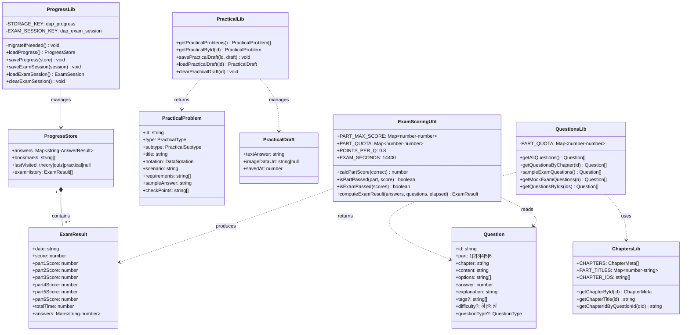

# 클래스 설계서

| 항목 | 내용 |
|:---|:---|
| 사업명 | DAP Master — 데이터아키텍처 전문가 자격증 시험 준비 웹사이트 |
| 작성일 | 2026-06-03 |
| 버전 | v0.2 |
| 기술 스택 | Next.js 14 / TypeScript 5 / React 18 (SSG, 서버 없음) |
| 아키텍처 | Domain → Service(lib) → Context → Pages/Components |

> v0.2 변경 사항: Phase 1(코어 인프라) 구현 완료 반영. 검증 결과 7개 파일 수정/신규 생성.

---

## 1. 클래스 목록

| CLS-ID | 클래스명 | 계층 | 파일 위치 | 상태 | 비고 |
|:---|:---|:---:|:---|:---:|:---|
| CLS-001 | Question | Domain | `types/index.ts` | ✅ 완료 | `part` 1\|2\|3\|4\|5\|6 |
| CLS-002 | ExamResult | Domain | `types/index.ts` | ✅ 완료 | `part5Score`, `part6Score` 추가 |
| CLS-003 | ProgressStore | Domain | `types/index.ts` | ✅ 완료 | `lastVisited.type`에 `'practical'` 추가 |
| CLS-004 | ExamSession | Domain | `types/index.ts` | ✅ 완료 | 변경 없음 |
| CLS-005 | ChapterMeta | Domain | `types/index.ts` | ✅ 완료 | `part` 1\|2\|3\|4\|5\|6 |
| CLS-006 | Stats | Domain | `types/index.ts` | ✅ 완료 | 변경 없음 |
| CLS-007 | PracticalProblem | Domain | `types/index.ts` | ✅ 완료 | 신규 인터페이스 |
| CLS-008 | PracticalDraft | Domain | `types/index.ts` | ✅ 완료 | 신규 인터페이스 |
| CLS-009 | ChaptersLib | Service | `lib/chapters.ts` | ✅ 완료 | CHAPTERS 21개, PART_TITLES 6개 |
| CLS-010 | QuestionsLib | Service | `lib/questions.ts` | ✅ 완료 | PART_QUOTA 추가, 75문항 배분 |
| CLS-011 | ProgressLib | Service | `lib/progress.ts` | ✅ 완료 | migrateIfNeeded 추가, 키 dap_* |
| CLS-012 | TheoryLib | Service | `lib/theory.ts` | ✅ 완료 | 변경 없음 |
| CLS-013 | PracticalLib | Service | `lib/practical.ts` | ✅ 완료 | 신규 생성 |
| CLS-014 | ExamScoringUtil | Service | `lib/exam.ts` | ✅ 완료 | 신규 생성 |
| CLS-015 | ProgressContext | Context | `context/ProgressContext.tsx` | 🔄 대기 | Phase 3에서 수정 |

---

## 2. 도메인 클래스 상세 (types/index.ts 최종)

```typescript
// ── 기존 타입 (수정 완료) ──────────────────────────────────────────────────
export type QuestionType = 'concept' | 'result' | 'completion' | 'error'

export interface Question {
  id: string
  part: 1 | 2 | 3 | 4 | 5 | 6  // ✅ 5·6 추가
  chapter: string
  content: string
  options: string[]
  answer: number
  explanation: string
  tags?: string[]
  difficulty?: '하' | '중' | '상'
  questionType?: QuestionType
}

export interface ExamResult {
  date: string
  score: number
  part1Score: number; part2Score: number; part3Score: number
  part4Score: number
  part5Score: number  // ✅ 신규
  part6Score: number  // ✅ 신규
  totalTime: number
  answers: Record<string, number>
}

export interface ProgressStore {
  answers: Record<string, AnswerResult>
  bookmarks: string[]
  lastVisited: { type: 'theory' | 'quiz' | 'practical'; id: string } | null  // ✅ practical 추가
  examHistory: ExamResult[]
}

export interface ChapterMeta {
  id: string
  part: 1 | 2 | 3 | 4 | 5 | 6  // ✅ 5·6 추가
  chapter: number
  title: string
  questionCount: number
}

// ── 실기 신규 타입 (CLS-007, CLS-008) ✅ 완료 ────────────────────────────────
export type PracticalType    = 'logical_model' | 'standard_form'
export type PracticalSubtype = 'type1' | 'type2' | 'entity' | 'standard'
export type DataNotation     = 'barker' | 'ie'

export interface PracticalProblem {
  id: string; type: PracticalType; subtype: PracticalSubtype
  title: string; notation: DataNotation; scenario: string
  requirements: string[]; sampleAnswer: string; checkPoints: string[]
}

export interface PracticalDraft {
  textAnswer: string; imageDataUrl: string | null; savedAt: number
}
```

---

## 3. 서비스 클래스 상세

### CLS-009: ChaptersLib (✅ 완료)

- CHAPTERS: 21개 (1~4과목 14개 + 5과목 3개 + 6과목 4개)
- PART_TITLES: 6개 (5='데이터베이스 설계와 이용', 6='데이터 품질 관리이해')
- CHAPTERS_BY_PART: 6과목 확장

### CLS-010: QuestionsLib (✅ 완료)

```typescript
const PART_QUOTA: Record<number, number> = {
  1: 10, 2: 10, 3: 10, 4: 25, 5: 10, 6: 10   // 합계 75
}
export function sampleExamQuestions(): Question[]  // 6과목 75문항
```

### CLS-011: ProgressLib (✅ 완료)

```typescript
const STORAGE_KEY      = 'dap_progress'        // 구: 'dasp_progress'
const EXAM_SESSION_KEY = 'dap_exam_session'    // 구: 'dasp_exam_session'

function migrateIfNeeded(): void               // ✅ 신규
export function loadProgress(): ProgressStore  // migrateIfNeeded() 호출
```

### CLS-013: PracticalLib (✅ 완료 — 신규)

```typescript
export function getPracticalProblems(): PracticalProblem[]
export function getPracticalById(id: string): PracticalProblem | undefined
export function savePracticalDraft(practiceId: string, draft: PracticalDraft): void
export function loadPracticalDraft(practiceId: string): PracticalDraft | null
export function clearPracticalDraft(practiceId: string): void
```

### CLS-014: ExamScoringUtil (✅ 완료 — 신규)

```typescript
export const PART_MAX_SCORE = { 1:8, 2:8, 3:8, 4:20, 5:8, 6:8 }
export const PART_QUOTA     = { 1:10, 2:10, 3:10, 4:25, 5:10, 6:10 }
export const POINTS_PER_Q = 0.8
export const EXAM_SECONDS = 14400  // 240분

export function calcPartScore(correctCount: number): number
export function isPartPassed(part: number, score: number): boolean
export function isExamPassed(scores: Record<number, number>): boolean
export function computeExamResult(answers, questions, elapsed): ExamResult
```

---

## 4. 클래스 다이어그램 (Mermaid)



---

## 5. 변경 영향도 분석 (v0.2 기준)

### 완료된 Phase 1 변경 사항

| 파일 | 변경 유형 | 상태 |
|:---|:---|:---:|
| `types/index.ts` | 타입 확장 + 신규 인터페이스 5개 | ✅ |
| `lib/chapters.ts` | CHAPTERS 21개, PART_TITLES 6개 | ✅ |
| `lib/questions.ts` | PART_QUOTA, sampleExamQuestions 6과목 | ✅ |
| `lib/progress.ts` | 키명 dap_*, migrateIfNeeded | ✅ |
| `lib/exam.ts` | 신규 생성 (ExamScoringUtil) | ✅ |
| `lib/practical.ts` | 신규 생성 (PracticalLib) | ✅ |
| `scripts/validate-questions.ts` | 정규식 p[1-6], part 범위 1~6 | ✅ |
| `pages/quiz/exam.tsx` | part5/6 Score 추가, EXAM_SECONDS=14400 | ✅ (부분) |
| `lib/chapters.test.ts` | 21개 챕터 기준으로 갱신 | ✅ |

### 남은 Phase 3·4·5 작업

| 파일 | 작업 내용 | Phase |
|:---|:---|:---:|
| `pages/theory/index.tsx` | 6과목 그리드 확장 | 3 |
| `pages/quiz/exam.tsx` | 전체 리팩토링 (lib/exam.ts 사용) | 3 |
| `pages/quiz/result.tsx` | 6과목 점수 + 실기 안내 | 3 |
| `pages/index.tsx` | DAP 브랜딩, 6과목 루프 | 3 |
| `context/ProgressContext.tsx` (CLS-015) | byPart 6과목 지원 | 3 |
| `pages/practical/*` | 실기 섹션 신규 구현 | 4 |
| `components/practical/*` | 실기 컴포넌트 신규 구현 | 4 |

---

## 6. 문서 버전 이력

| 버전 | 일자 | 변경 내용 |
|:---|:---|:---|
| v0.1 | 2026-06-03 | 초안 생성 — 15개 클래스 설계 |
| v0.2 | 2026-06-03 | Phase 1 구현 완료 반영 — types/lib/scripts 7개 파일 수정/신규, 테스트 15개 통과 |
