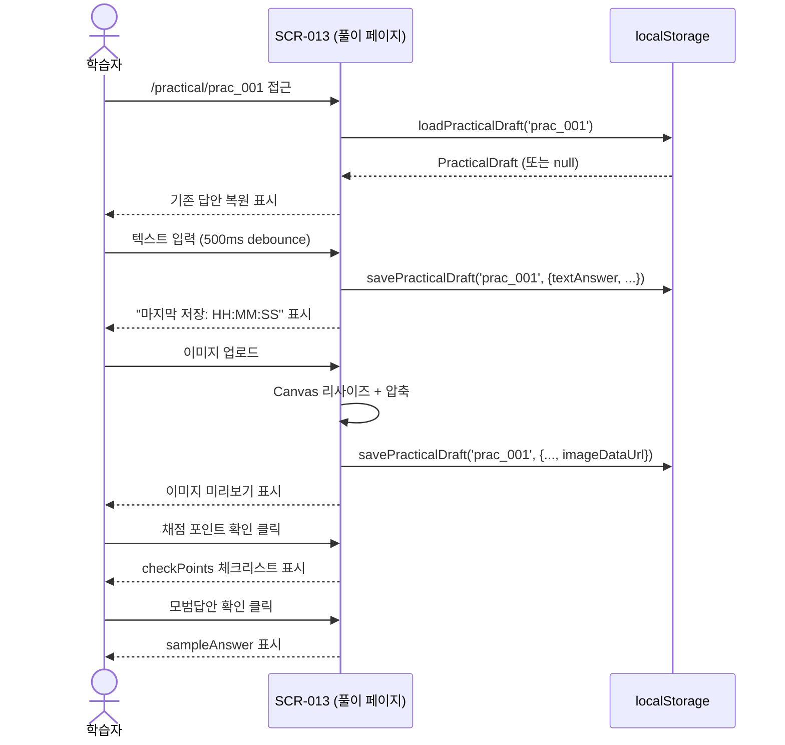
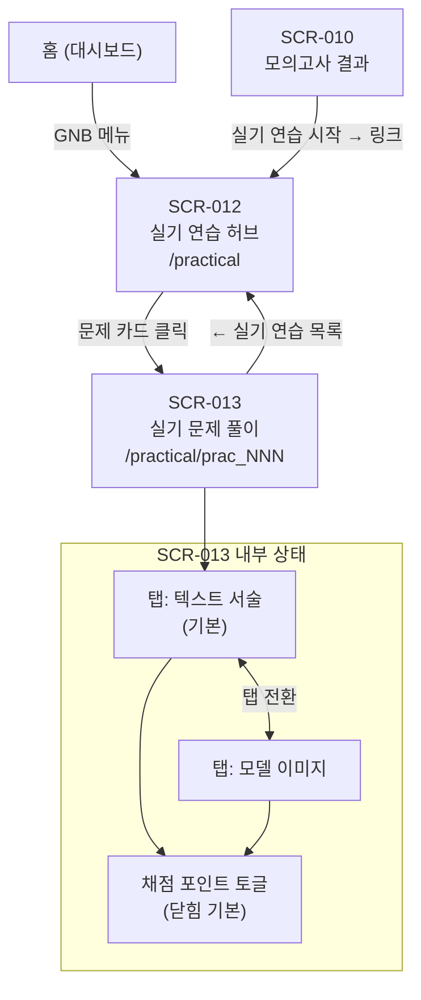

# 화면 명세서 — 실기 연습 섹션

| 항목 | 내용 |
|:---|:---|
| 사업명 | DAP Master — 데이터아키텍처 전문가 자격증 시험 준비 웹사이트 |
| 작성일 | 2026-06-03 |
| 버전 | v0.1 |
| 대상 화면 | SCR-012 (실기 연습 허브), SCR-013 (실기 문제 풀이) |
| 근거 문서 | 화면목록_DAP_Master_20260603.md / 유즈케이스_DAP_Master_20260603.md (UC-005) |

---

## 1. 화면 개요

| SCR-ID | 화면명 | URL | 유형 | 연계 UC | 연계 FR | 구현 파일 |
|:---|:---|:---|:---:|:---:|:---|:---|
| SCR-012 | 실기 연습 허브 | `/practical` | LIST | UC-005 | FR-016, FR-021 | `pages/practical/index.tsx` |
| SCR-013 | 실기 문제 풀이 | `/practical/[practiceId]` | FORM | UC-005 | FR-017~020 | `pages/practical/[practiceId].tsx` |

---

## 2. SCR-012 — 실기 연습 허브

### 2.1 화면 개요

| 항목 | 내용 |
|:---|:---|
| 화면명 | 실기 연습 허브 |
| URL | `/practical` |
| 렌더링 방식 | SSG (getStaticProps) — 빌드 시 생성 |
| 진입 경로 | GNB 네비게이션 / `/quiz/result` 실기 연습 링크 |
| 이탈 경로 | SCR-013 (문제 카드 클릭) |
| 접근 권한 | 없음 (비인증 공개) |

### 2.2 레이아웃

```
┌─────────────────────────────────────────────────────────┐
│  TopBar (GNB)                                            │
├─────────────────────────────────────────────────────────┤
│  실기 연습                                               │
│  논리 데이터 모델 작성·표준화 정의서 작성으로 대비하세요  │
├──────────────────────┬──────────────────────────────────┤
│ 🗺️ 논리 데이터 모델 작성 │ 📋 표준화 정의서 작성           │
│ 지문→엔터티·관계·속성    │ 엔터티정의/데이터표준정의       │
├──────────────────────┴──────────────────────────────────┤
│ ⚠️ 표기법 주의사항                                      │
│ • 바커/IE 중 하나만 일관 사용 (혼용 감점)               │
│ • 관계명 필수 표기, 최소 3NF 적용                       │
├─────────────────────────────────────────────────────────┤
│  🗺️ 논리 데이터 모델 작성                               │
│  ┌──────────────────────┐  ┌──────────────────────┐    │
│  │ [유형1] [바커]       │  │ [유형2] [IE]         │    │
│  │ 제목 텍스트          │  │ 제목 텍스트          │    │
│  │ 지문 미리보기 (80자) │  │ 지문 미리보기 (80자) │    │
│  └──────────────────────┘  └──────────────────────┘    │
├─────────────────────────────────────────────────────────┤
│  📋 표준화 정의서 작성                                  │
│  ┌──────────────────────┐  ┌──────────────────────┐    │
│  │ [엔터티 정의]        │  │ [데이터 표준]        │    │
│  │ 제목 텍스트          │  │ 제목 텍스트          │    │
│  │ 지문 미리보기 (80자) │  │ 지문 미리보기 (80자) │    │
│  └──────────────────────┘  └──────────────────────┘    │
└─────────────────────────────────────────────────────────┘
```

### 2.3 구성요소 상세

#### 2.3.1 유형 안내 카드 (2개)

| 속성 | 논리 데이터 모델 | 표준화 정의서 |
|:---|:---|:---|
| 아이콘 | 🗺️ | 📋 |
| 제목 | 논리 데이터 모델 작성 | 표준화 정의서 작성 |
| 설명 | 지문 분석 → 엔터티·관계·속성·서브타입 정의 | 엔터티 정의 / 데이터 표준 정의 |

#### 2.3.2 표기법 안내 배너

- 배경색: amber-50
- 내용: 바커·IE 혼용 금지, 관계명 필수, 3NF 적용

#### 2.3.3 문제 카드 (PracticalProblem 1건당 1카드)

| 필드 | 표시 방법 | 데이터 소스 |
|:---|:---|:---|
| 유형 뱃지 | `type1→유형1`, `type2→유형2`, `entity→엔터티 정의`, `standard→데이터 표준` | `problem.subtype` |
| 표기법 뱃지 | `barker→바커(Barker)`, `ie→IE 표기법` | `problem.notation` |
| 제목 | 폰트 semibold, hover 시 primary-700 | `problem.title` |
| 지문 미리보기 | 앞 80자 + `...` | `problem.scenario.slice(0, 80)` |
| 링크 | `/practical/${problem.id}` | `problem.id` |

### 2.4 이벤트 처리

| 이벤트 | 대상 | 처리 |
|:---|:---|:---|
| 페이지 로드 | getStaticProps | `getPracticalProblems()` 호출 → 문제 목록 렌더 |
| 카드 클릭 | `<Link href="/practical/{id}">` | SCR-013으로 이동 |

### 2.5 출력 데이터

| 항목 | 타입 | 설명 |
|:---|:---|:---|
| problems | `PracticalProblem[]` | 전체 실기 문제 목록 |
| logicalProblems | 필터 | `type === 'logical_model'` |
| standardProblems | 필터 | `type === 'standard_form'` |

### 2.6 예외 처리

| 조건 | 표시 |
|:---|:---|
| 문제 없음 (`problems.length === 0`) | "📭 아직 실기 연습 문제가 없습니다." 안내 |

---

## 3. SCR-013 — 실기 문제 풀이

### 3.1 화면 개요

| 항목 | 내용 |
|:---|:---|
| 화면명 | 실기 문제 풀이 |
| URL | `/practical/[practiceId]` (예: `/practical/prac_001`) |
| 렌더링 방식 | SSG (getStaticPaths + getStaticProps) — fallback: false |
| 진입 경로 | SCR-012 문제 카드 클릭 |
| 이탈 경로 | SCR-012 (← 실기 연습 목록 클릭) |
| 접근 권한 | 없음 (비인증 공개) |
| 로컬 저장소 | `dap_practical_{practiceId}` — 답안 자동 저장 |

### 3.2 레이아웃

```
┌─────────────────────────────────────────────────────────┐
│ ← 실기 연습 목록          논리 데이터 모델 작성         │  ← 상단 헤더 (shrink-0)
├────────────────────────┬────────────────────────────────┤
│  지문 패널 (40%)  aside│  답안 패널 (60%)  main         │
│                        │                                 │
│  [유형1] [유형명]      │  ┌──────────────────────────┐  │
│  [IE표기법] 주의⚠️    │  │ 📝 텍스트 서술 │ 📷 이미지│  │ ← 탭 전환
│                        │  └──────────────────────────┘  │
│  📌 제목               │                                 │
│                        │  [텍스트 탭 활성 시]            │
│  지문 내용             │  ┌──────────────────────────┐  │
│  (스크롤 가능)         │  │                          │  │
│                        │  │  textarea               │  │
│  ─────                 │  │  (자동 크기, 폰트Mono)   │  │
│  요구사항              │  │                          │  │
│  ① 요구사항1           │  └──────────────────────────┘  │
│  ② 요구사항2           │  마지막 저장: HH:MM:SS          │
│  ...                   │                                 │
│                        │  [채점 포인트 확인] ← 토글      │
│                        │  (펼치면 체크리스트 표시)        │
└────────────────────────┴────────────────────────────────┘
```

```
[이미지 탭 활성 시]
┌────────────────────────────────┐
│  이미지 없을 때:                │
│  ┌──────────────────────────┐  │
│  │  📷                      │  │
│  │  이미지 선택             │  │
│  │  (drag & drop 영역)      │  │
│  │  JPEG/PNG/WebP 허용      │  │
│  └──────────────────────────┘  │
│                                 │
│  이미지 있을 때:                │
│  ┌──────────────────────────┐  │
│  │  [미리보기 이미지]        │  │
│  └──────────────────────────┘  │
│  [이미지 교체]  [삭제]          │
└────────────────────────────────┘
```

### 3.3 구성요소 상세

#### 3.3.1 상단 헤더 (공통)

| 요소 | 설명 |
|:---|:---|
| ← 실기 연습 목록 | `/practical` 링크 |
| 문제 유형 표시 | `type === 'logical_model'` → "논리 데이터 모델 작성" |

#### 3.3.2 지문 패널 (ScenarioPanel, 좌 40%)

| 구성 요소 | 내용 |
|:---|:---|
| 유형 뱃지 | `type`, `subtype` 기반 레이블 |
| 표기법 경고 | ⚠️ 사용 표기법 안내 (amber 배경) |
| 제목 | `problem.title` |
| 지문 텍스트 | `problem.scenario` — 전체 표시, 세로 스크롤 |
| 요구사항 목록 | `problem.requirements` — 번호 + 텍스트 |

#### 3.3.3 답안 패널 (우 60%)

**탭 컨트롤:**

| 탭 ID | 탭명 | 기본 상태 |
|:---:|:---|:---:|
| `text` | 📝 텍스트 서술 | 활성 (기본) |
| `image` | 📷 모델 이미지 | 비활성 |

#### 3.3.4 텍스트 서술 탭 (AnswerTextEditor)

| 속성 | 내용 |
|:---|:---|
| 입력 유형 | `<textarea>` — 자동 높이 조절 |
| 폰트 | `font-mono` (코드 느낌) |
| 초기값 | 로컬 저장 값 (`draft.textAnswer`) |
| 자동 저장 | 입력 후 500ms debounce → `savePracticalDraft()` |
| 저장 키 | `dap_practical_{practiceId}` |
| placeholder | 엔터티·관계·속성 작성 예시 안내 |
| 글자 수 표시 | `{text.length}자 · 자동 저장` |

**유효성 규칙:** 없음 (자유 서술)

#### 3.3.5 모델 이미지 탭 (ModelImageUpload)

| 속성 | 내용 |
|:---|:---|
| 입력 | `<input type="file" accept="image/*">` |
| 허용 포맷 | JPEG, PNG, WebP |
| 크기 제한 | 자동 리사이즈 (긴 변 ≤ 1920px) |
| 용량 제한 | base64 > 2MB 시 JPEG 품질 낮춰 재압축 |
| 저장 방식 | Canvas API → base64 → localStorage |
| 미리보기 | `` 태그 — 업로드 즉시 표시 |
| 저장 완료 | 자동 저장 (`handleImageSave`) |
| 이미지 교체 | 파일 재선택 |
| 삭제 | imageDataUrl → null, 로컬 저장 갱신 |

#### 3.3.6 마지막 저장 시각

| 조건 | 표시 |
|:---|:---|
| 저장 이력 없음 | 미표시 |
| 저장 완료 | "마지막 저장: HH:MM:SS" (우측 정렬) |

#### 3.3.7 채점 포인트 (ScoringGuide)

**닫힌 상태 (기본):**

```
[ 📋 채점 포인트 확인 ]  ← 점선 버튼
```

**펼친 상태:**

```
┌────────────────────────────────────────────┐
│ 채점 포인트     [N/M]   [닫기]             │
│ ████████████░░░░░░░ (진행률 바)            │
│                                             │
│ ☐ 채점 포인트 1 텍스트                    │
│ ☑ 채점 포인트 2 텍스트 (취소선)           │
│ ☐ 채점 포인트 3 텍스트                    │
│ ...                                         │
│                                             │
│ ▼ 모범답안 확인  (토글)                    │
│  (펼치면 모범답안 텍스트 표시)              │
└────────────────────────────────────────────┘
```

| 요소 | 설명 |
|:---|:---|
| 체크리스트 | `problem.checkPoints` — 클릭으로 체크/해제 |
| 진행률 바 | `checkedCount / total * 100%` |
| 모범답안 | `problem.sampleAnswer` — 토글로 숨김/표시 |
| 상태 저장 | 로컬 상태(useState)만 — localStorage 저장 없음 |

### 3.4 상태 관리

| 상태명 | 타입 | 초기값 | 설명 |
|:---|:---|:---|:---|
| `tab` | `'text' \| 'image'` | `'text'` | 현재 활성 탭 |
| `draft` | `PracticalDraft` | `{textAnswer:'', imageDataUrl:null, savedAt:0}` | 현재 답안 |
| `draftRef` | `useRef<PracticalDraft>` | — | 최신 draft 추적 (re-render 방지) |
| `savedAt` | `Date \| null` | `null` | 마지막 저장 시각 |

### 3.5 이벤트 처리

| 이벤트 | 대상 | 처리 |
|:---|:---|:---|
| 페이지 로드 | `useEffect` | `loadPracticalDraft(id)` → draft 복원, savedAt 설정 |
| 텍스트 입력 | `<textarea onChange>` | 500ms debounce → `handleTextSave()` → localStorage 저장 |
| 이미지 선택 | `<input onChange>` | Canvas 리사이즈 → base64 → `handleImageSave()` → localStorage 저장 |
| 이미지 삭제 | `[삭제] 버튼` | imageDataUrl = null → localStorage 갱신 |
| 탭 전환 | 탭 버튼 클릭 | tab 상태 변경 (답안 내용 유지) |
| 채점 포인트 체크 | 체크리스트 항목 클릭 | checked 배열 토글 (로컬 상태) |
| 뒤로 가기 | `← 실기 연습 목록` | `/practical` 이동 |
| 세션 만료 없음 | — | 실기 화면은 타이머 없음 (자가 채점 방식) |

### 3.6 데이터 흐름



### 3.7 로컬 저장소 스키마

```typescript
// 키: dap_practical_{practiceId}  예: dap_practical_prac_001
interface PracticalDraft {
  textAnswer: string        // 텍스트 서술 답안 (빈 문자열 가능)
  imageDataUrl: string | null  // base64 JPEG (null = 이미지 없음)
  savedAt: number           // 저장 시각 Unix ms (0 = 미저장)
}
```

### 3.8 예외 처리

| 조건 | 처리 |
|:---|:---|
| 존재하지 않는 practiceId | SSG `fallback: false` → Next.js 404 페이지 |
| Canvas 2D context 생성 실패 | `reject(Error)` → catch에서 "이미지 처리 중 오류" 메시지 |
| 이미지 2MB 초과 | JPEG 품질 0.9→0.3 반복 압축 (품질 0.3 이하면 압축 중단) |
| 이미지 처리 중 오류 | `<p className="text-red-500">이미지 처리 중 오류가 발생했습니다.</p>` |

---

## 4. 공통 컴포넌트

| 컴포넌트 | 파일 | 사용 화면 | 설명 |
|:---|:---|:---|:---|
| `PracticalLayout` | `components/practical/PracticalLayout.tsx` | SCR-013 | `<aside>` 40% + `<main>` 60% 분할 레이아웃 |
| `ScenarioPanel` | `components/practical/ScenarioPanel.tsx` | SCR-013 | 지문·요구사항 표시 (읽기 전용) |
| `AnswerTextEditor` | `components/practical/AnswerTextEditor.tsx` | SCR-013 | textarea + 자동 저장 |
| `ModelImageUpload` | `components/practical/ModelImageUpload.tsx` | SCR-013 | 이미지 업로드 + Canvas 처리 |
| `ScoringGuide` | `components/practical/ScoringGuide.tsx` | SCR-013 | 채점 포인트 + 모범답안 토글 |

---

## 5. 화면 흐름도



---

## 6. 관련 요구사항 추적

| FR-ID | 요구사항명 | 대응 SCR | 구현 확인 |
|:---|:---|:---:|:---:|
| FR-016 | 실기 연습 허브 | SCR-012 | ✅ |
| FR-017 | 논리 데이터 모델 연습 (유형1) | SCR-013 | ✅ |
| FR-018 | 논리 데이터 모델 연습 (유형2) | SCR-013 | ✅ |
| FR-019 | 표준화 정의서 연습 | SCR-013 | ✅ |
| FR-020 | 실기 채점 포인트 확인 | SCR-013 | ✅ |
| FR-021 | 표기법 안내 | SCR-012 | ✅ |
| BR-022 | 실기 답안 자동 저장 | SCR-013 | ✅ |
| BR-023 | 이미지 리사이즈 (1920px) | SCR-013 | ✅ |
| BR-024 | 이미지 용량 제한 (2MB) | SCR-013 | ✅ |
| BR-025 | 실기 답안 키 형식 | SCR-013 | ✅ |
| BR-026 | 실기 서버 제출 없음 | SCR-013 | ✅ |

---

## 7. 문서 버전 이력

| 버전 | 일자 | 변경 내용 |
|:---|:---|:---|
| v0.1 | 2026-06-03 | 초안 생성 — SCR-012·013 구현 코드 기반 명세 작성 |
