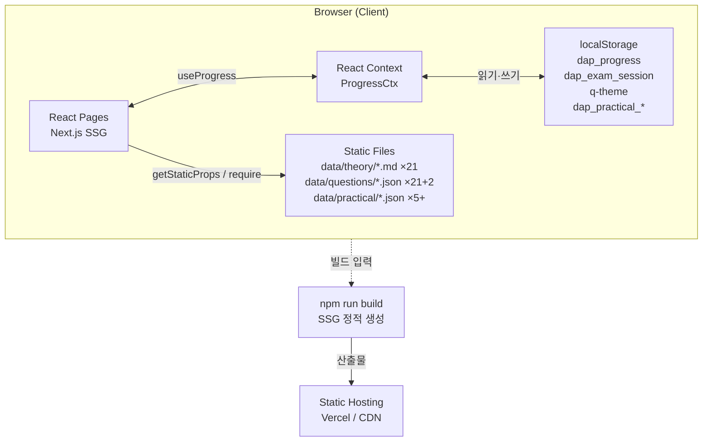
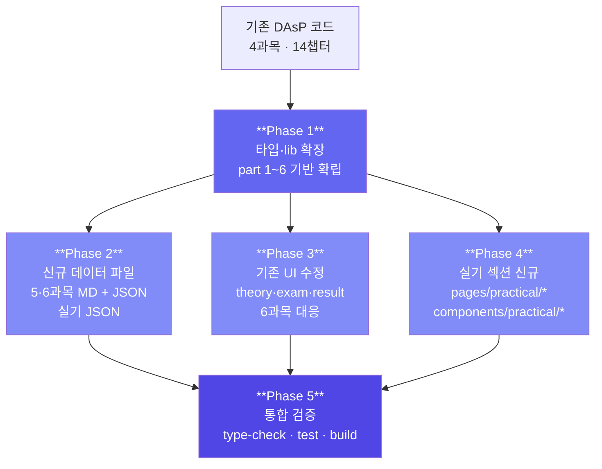
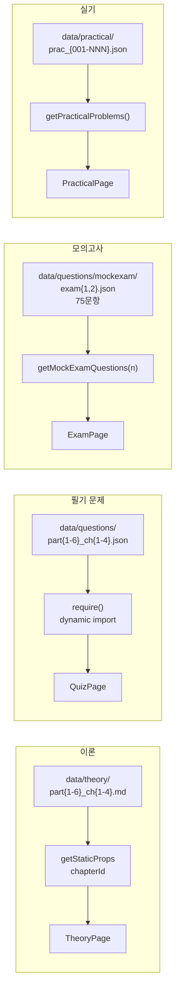
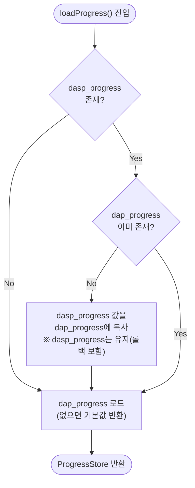
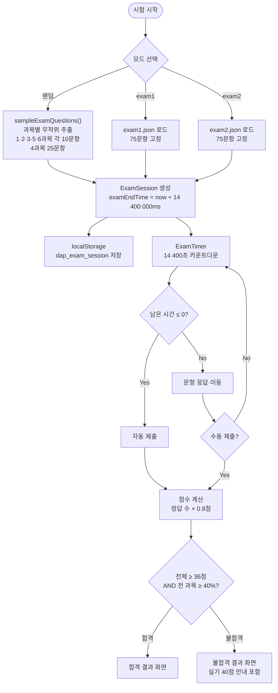
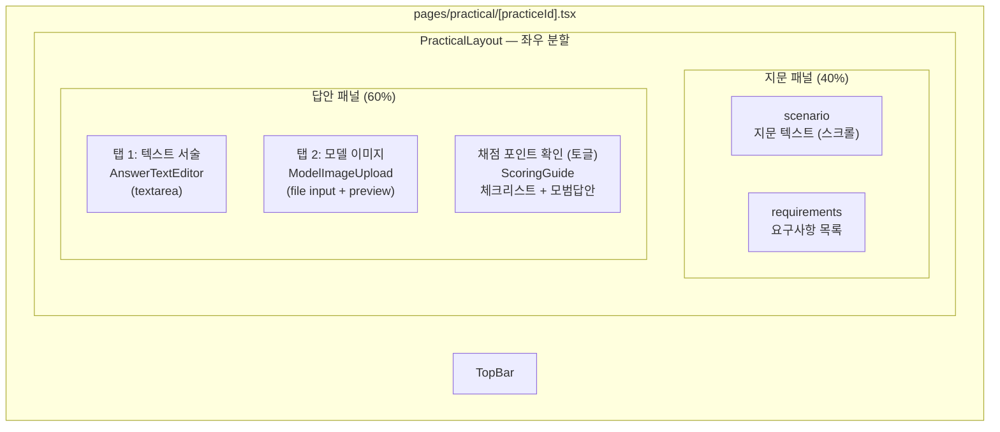
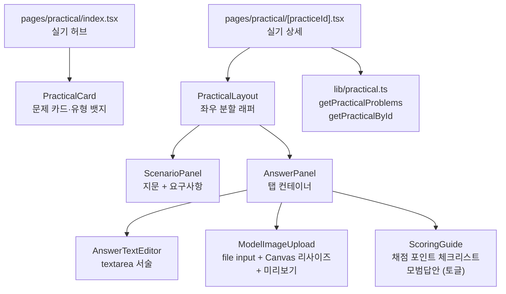
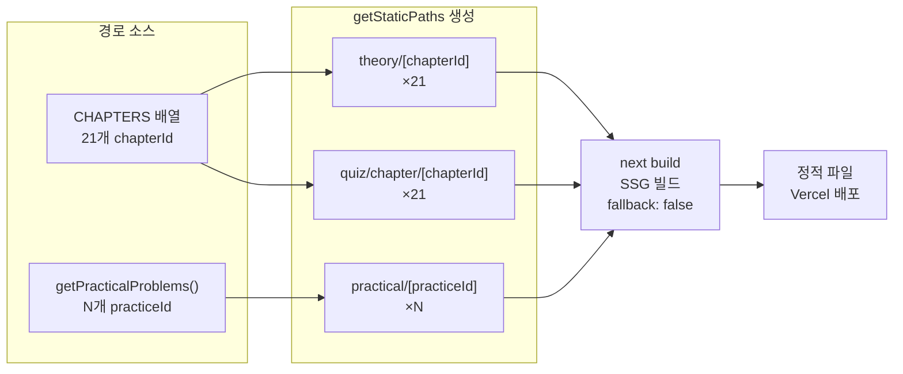

# ARCHITECTURE — DAP Master

---

## 시스템 개요



**핵심 제약**: 서버 없음, DB 없음, 외부 API 없음. 모든 동작은 클라이언트 사이드.

---

## 점진적 업그레이드 전략



> Phase 2·3은 Phase 1 완료 후 **병렬 진행** 가능. Phase 4는 Phase 2(실기 JSON) 완료 후 시작 권장.

---

## 정적 데이터 흐름



---

## localStorage 마이그레이션 흐름



---

## 필기 모의고사 흐름



### 점수 계산 상수

```typescript
const PART_QUOTA: Record<number, number> = {
  1: 10, 2: 10, 3: 10, 4: 25, 5: 10, 6: 10   // 합계 75
}
const PART_MAX_SCORE: Record<number, number> = {
  1: 8, 2: 8, 3: 8, 4: 20, 5: 8, 6: 8        // 합계 60
}
const POINTS_PER_Q = 0.8
// 전체 합격선: 36점 이상 (60점 만점의 60%)
// 과목별 합격선: 해당 과목 배점 × 40%
```

---

## 실기 연습 — 이미지 업로드 흐름

```mermaid
sequenceDiagram
    actor User as 사용자
    participant Input as &lt;input type="file"&gt;
    participant FR as FileReader API
    participant Canvas as Canvas API
    participant Preview as 미리보기 &lt;img&gt;
    participant LS as localStorage

    User->>Input: 이미지 파일 선택
    Input->>FR: readAsDataURL(file)
    FR-->>Canvas: dataUrl 전달
    Canvas->>Canvas: 긴 변 > 1920px이면 리사이즈
    Canvas-->>Preview: 리사이즈된 dataUrl → 미리보기 표시
    Canvas->>LS: dap_practical_{id}.imageDataUrl 저장
    LS-->>User: 저장 완료 (자동)

    Note over Canvas,LS: 서버 업로드 없음. base64로 브라우저에만 저장.
    Note over LS: 2MB 초과 시 Canvas 품질 낮춰 재압축
```

### 실기 페이지 레이아웃



---

## 컴포넌트 의존 관계 (신규 — 실기 섹션)



---

## SSG 경로 생성



> `CHAPTERS` 배열이 단일 소스(Single Source of Truth). `getStaticPaths`에 경로를 하드코딩하지 않는다.

---

## 다크모드

```css
/* globals.css */
:root                { --q-bg: #fff;     --q-text: #111; }
[data-theme="dark"]  { --q-bg: #1a1a2e; --q-text: #e0e0e0; }
```

`localStorage('q-theme')` 로 persist. `_document.tsx`에서 초기 theme 주입 (FOUC 방지).
